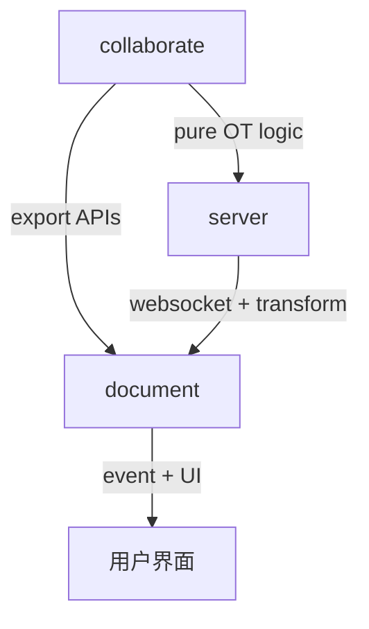

# Quill 协同编辑架构设计文档

## 项目结构（Monorepo）

```
/packages
  ├── collaborate/     # 协同算法核心模块（OT算法 + 会话管理）
  └── document/        # UI 文档渲染模块（Quill 编辑器 + 事件绑定）
```

---

## 📁 collaborate 包

> 协同编辑的纯逻辑实现，职责清晰、可复用、无 UI 依赖。

### 📌 目录结构

```
collaborate/
  ├── model/
  │   └── DocumentModel.ts      # 文档状态（Delta 容器）
  ├── engine/
  │   └── OTEngine.ts           # OT 核心算法（transform 规则）
  ├── session/
  │   └── OTSession.ts          # 单用户会话（提交本地操作、接收远程同步）
  └── index.ts                  # 暴露统一 API
```

### 模块职责

| 模块            | 职责说明                                          |
| --------------- | ------------------------------------------------- |
| `DocumentModel` | 管理文档内容状态，封装 Delta 的 apply/clone/clear |
| `OTEngine`      | 实现核心 transform 操作，基于 `quill-delta`       |
| `OTSession`     | 表示单个用户的协同上下文，会话控制器              |
| `index.ts`      | 对外暴露协同核心能力的统一接口（export）          |

---

## document 包

> 展示层逻辑，挂载 Quill 编辑器，监听编辑器事件并驱动协同。

### 功能概述

- 初始化 Quill 编辑器（原生 HTML or Vue/React 后续支持）
- 捕获用户编辑事件 → 提交协同操作
- 监听远程同步事件（模拟服务端）→ 调用 `receiveRemote`
- 渲染最终文档结果（调用 `quill.updateContents()`

---

## 模块之间协作关系图

```
 User Input
     ↓
[ document/main.ts ] ←←←←←←←←←
     ↓                                     ↑
commitLocal(Delta)                         |
     ↓                                     |
[ OTSession ] ——————→ transform ←————— [ OTEngine ]
     ↓                                     ↑
apply(Delta)                               |
     ↓                                     |
[ DocumentModel ]                          |
     ↓                                     |
Quill.updateContents() ← receiveRemote ——————
```

---

## 生命周期管理建议

### OTEngine

- 纯函数工具类，无状态
- 不需要 `destroy()`

### DocumentModel

- 存储 Delta 内容
- 可选：增加 `clear()` 方法
- 通常不需要显式释放

### OTSession

- 表示用户与文档的协作会话
- 管理本地/ 远程 Delta 应用流转
- 建议实现 `destroy()` 方法，用于销毁内部引用（pending、ws 等）

```ts
destroy() {
  this.pending = [];
  // 后续若有 ws 连接，可关闭： this.ws?.close();
  // 清空文档状态：this.document.clear();
}
```

---

## 未来计划：加入 Server 模块

```bash
/packages
  ├── server/              # Node/Koa 服务端，统一转发操作广播
  │   └── OTServer.ts      # 中央服务器，接收 + transform + 转发
```

### Server 的职责：

- 维护操作序列（opSeq）
- 对操作进行全局排序
- transform 后广播到所有用户
- 记录每个用户未 ACK 的 pending 操作

---

## 后续要补充的可视化内容

### 协同流程图（编辑/同步全景）

```mermaid
sequenceDiagram
  participant UserA
  participant UserB
  participant Server

  UserA->>Server: 提交 opA（seq:1）
  Server-->>UserA: ack opA（不变）
  Server-->>UserB: transform(opA) 后广播

  UserB->>Server: 提交 opB（seq:1）
  Server: 发现 seq 冲突，转为 seq:2，transform(opB, opA)
  Server-->>UserA: transform(opB) 后广播
  Server-->>UserB: ack（opB'）
```

### 文件组织架构图（模块层级）



---

## 结话

该架构旨在实现高内联、低耦合的协同编辑平台：

- 逻辑与 UI 解耦
- 支持多个框架实现（Vue/React/Native）
- 可插拔协同策略（OT / CRDT）
- 基于 Delta 格式适配 Quill 与其他富文本框架

---

> 后续可将本文档拆分为 `README.md`（简略版）与 `docs/architecture.md`（完整设计版），也可以集成 mermaid 或 draw\.io 图进行增强展示。
