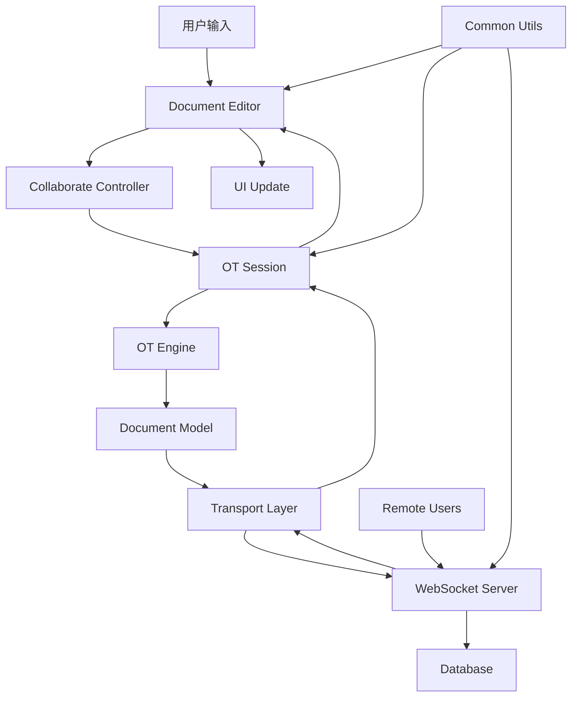
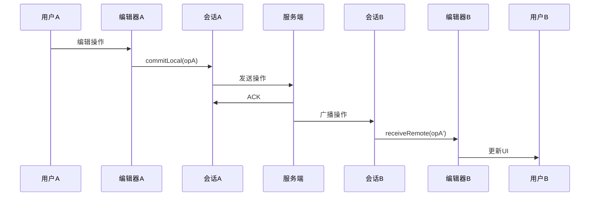
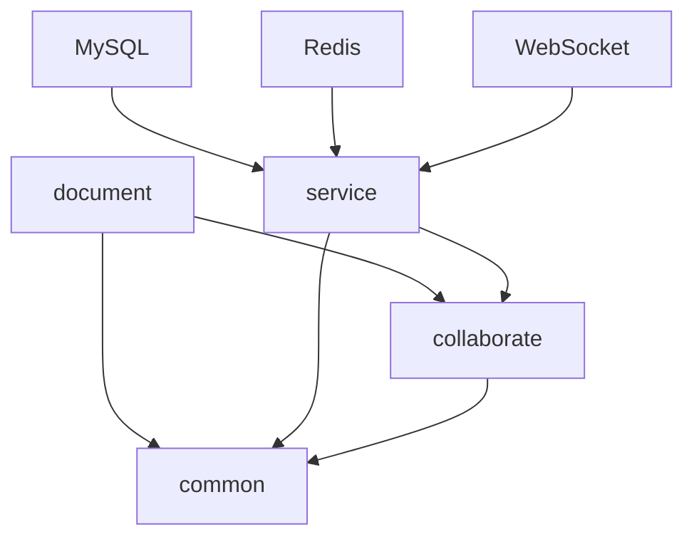
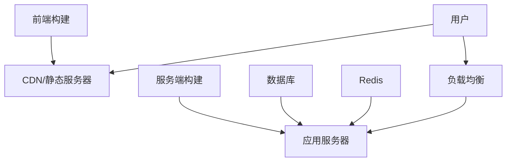

# Delta-OT 协同编辑系统架构设计文档

> 基于 Quill Delta 的完整协同编辑系统架构设计，采用 Monorepo 架构，实现高内聚低耦合的模块化设计

## 系统整体架构

### 项目结构（Monorepo）

```bash
delta-ot/
├── packages/
│   ├── collaborate/     # 协同算法核心模块（OT算法 + 会话管理）
│   ├── document/        # 文档编辑器前端（Vue 3 + Quill）
│   ├── service/         # 服务端（Node.js + Koa + WebSocket）
│   └── common/          # 通用工具包（日志系统等）
├── Architecture.md      # 架构设计文档
├── delta_ot_document.sql # 数据库结构
└── README.md           # 项目说明
```

### 技术栈概览

| 层级 | 技术栈 | 说明 |
|------|--------|------|
| **前端** | Vue 3 + TypeScript + Quill 2.0 | 现代化文档编辑器 |
| **协同核心** | TypeScript + quill-delta | OT 算法实现 |
| **服务端** | Node.js + Koa + TypeScript | RESTful API + WebSocket |
| **数据层** | MySQL + Sequelize + Redis | 数据持久化 + 缓存 |
| **构建工具** | Vite + tsup + pnpm | 现代化构建体系 |

---

## 包架构详解

### `@delta-ot/collaborate` - 协同算法核心

> 协同编辑的纯逻辑实现，职责清晰、可复用、无 UI 依赖

#### 核心模块

```bash
collaborate/
├── engine/              # OT 引擎核心算法
│   ├── OTEngine.ts      # 操作转换实现
│   ├── README.md        # 引擎设计文档
│   └── ot-engine.md     # 详细架构说明
├── session/             # 协同会话管理
│   ├── OTSession.ts     # 会话控制器
│   ├── README.md        # 会话设计文档
│   └── ot-session.md    # 详细设计说明
├── model/               # 文档模型
│   ├── DocumentModel.ts # 文档状态管理
│   └── README.md        # 模型说明
├── transport/           # 传输层
│   ├── WebSocketClient.ts
│   ├── CollaborationWS.ts
│   ├── README.md        # 传输层说明
│   └── signaling-design.md # 信令设计
├── tests/               # 测试用例
│   ├── engine/          # OT 算法测试
│   ├── session/         # 会话测试
│   └── utils/           # 工具测试
├── utils/               # 工具函数
│   ├── AttributeConflictResolver.ts
│   ├── Logger.ts
│   └── common.ts
└── index.ts             # 统一导出接口
```

#### 模块职责

| 模块 | 职责说明 | 核心功能 |
|------|----------|----------|
| **OTEngine** | OT 算法核心 | transform、compose、apply 操作 |
| **OTSession** | 会话管理 | 本地/远程操作流转、状态管理 |
| **DocumentModel** | 文档状态 | Delta 容器、版本管理 |
| **Transport** | 通信层 | WebSocket 封装、信令处理 |
| **Utils** | 工具支持 | 冲突解决、日志、通用工具 |

#### 设计原则

- **纯函数设计**：OT 引擎保持无状态，确保结果一致性
- **模块解耦**：各模块职责单一，接口清晰
- **可测试性**：每个模块都有完整的单元测试
- **可扩展性**：支持多种协同策略（OT/CRDT）

### `@delta-ot/document` - 文档编辑器

> 基于 Vue 3 + Quill 的现代化文档编辑器，提供完整的协同编辑 UI 体验

#### 技术架构

```bash
document/
├── src/
│   ├── components/          # Vue 组件
│   │   ├── Document/        # 文档组件
│   │   ├── Editor/          # 编辑器组件
│   │   └── ListItem/        # 列表项组件
│   ├── controllers/         # 控制器层
│   │   ├── DocumentManager.ts      # 文档管理器
│   │   ├── CollaborateController.ts # 协同控制器
│   │   ├── WebsocketController.ts  # WebSocket 控制器
│   │   └── CollaborationMediator.ts # 协同中介者
│   ├── pages/               # 页面组件
│   │   ├── DocumentPage/    # 文档页面
│   │   ├── LoginPage/       # 登录页面
│   │   └── FilePage/        # 文件管理页面
│   ├── test-lab/            # 测试实验室
│   │   ├── collab/          # 协同测试
│   │   └── utils/           # 测试工具
│   ├── store/               # 状态管理
│   │   ├── useDocStore.ts   # 文档状态
│   │   └── useUserStore.ts  # 用户状态
│   ├── services/            # 服务层
│   │   ├── user.ts          # 用户服务
│   │   └── file.ts          # 文件服务
│   └── utils/               # 工具函数
```

#### 核心功能

- **Quill 编辑器集成**：基于 Quill 2.0 的富文本编辑器
- **协同编辑 UI**：实时显示多用户编辑状态
- **测试实验室**：内置协同编辑测试框架
- **用户管理**：完整的用户登录和权限管理
- **文件管理**：文档的增删改查功能

#### 设计特点

- **组件化设计**：高度模块化的 Vue 组件
- **状态管理**：使用 Pinia 进行状态管理
- **响应式设计**：支持多设备适配
- **测试友好**：内置完整的测试框架

### `service` - 服务端

> 基于 Node.js + Koa 的协同编辑服务端，提供 WebSocket 通信和 HTTP API

#### 服务架构

```bash
service/
├── src/
│   ├── controllers/         # 控制器层
│   │   ├── user.ts          # 用户控制器
│   │   ├── file.ts          # 文件控制器
│   │   └── admin.ts         # 管理控制器
│   ├── sessions/            # 文档会话管理
│   │   ├── DocumentSession.ts       # 文档会话
│   │   ├── DocumentSessionManager.ts # 会话管理器
│   │   ├── OpHistoryBuffer.ts       # 操作历史缓冲
│   │   └── README.md        # 会话管理说明
│   ├── socket/              # WebSocket 处理
│   │   ├── BaseSocketConnection.ts  # 基础连接
│   │   ├── ClientConnection.ts      # 客户端连接
│   │   └── connection.ts    # 连接管理
│   ├── db/                  # 数据库层
│   │   ├── models/          # 数据模型
│   │   │   ├── User.ts      # 用户模型
│   │   │   ├── File.ts      # 文件模型
│   │   │   └── index.ts     # 模型导出
│   │   └── index.ts         # 数据库配置
│   ├── middleware/          # 中间件
│   │   ├── auth.ts          # 认证中间件
│   │   └── withBody.ts      # 请求体处理
│   ├── routes/              # 路由定义
│   │   ├── user.ts          # 用户路由
│   │   ├── file.ts          # 文件路由
│   │   └── admin.ts         # 管理路由
│   ├── utils/               # 工具函数
│   │   ├── jwt.ts           # JWT 工具
│   │   ├── redis.ts         # Redis 工具
│   │   └── response.ts      # 响应工具
│   └── index.ts             # 服务入口
```

#### 核心功能

- **WebSocket 服务**：实时协同编辑通信
- **文档会话管理**：多文档并发编辑支持
- **用户认证**：JWT 认证和权限管理
- **数据持久化**：MySQL 数据库存储
- **缓存管理**：Redis 缓存支持

#### 技术特点

- **模块化架构**：清晰的 MVC 分层
- **实时通信**：WebSocket 长连接支持
- **数据一致性**：事务管理和并发控制
- **可扩展性**：支持水平扩展

### `common` - 通用工具

> 项目通用工具包，提供日志系统等基础功能

#### 功能模块

```bash
common/
├── src/
│   ├── utils/
│   │   ├── Logger.ts        # 日志系统
│   │   ├── Logger.md        # 日志系统说明
│   │   └── Logger.example.ts # 使用示例
│   └── index.ts             # 统一导出
```

#### 核心功能

- **全局日志系统**：支持多客户端、多级别的日志管理
- **工具函数**：项目通用的工具函数

---

## 模块协作关系

### 数据流架构



### 协同编辑流程



### 模块依赖关系



---

## 测试架构

### 测试分层

```bash
tests/
├── unit/              # 单元测试
│   ├── engine/        # OT 引擎测试
│   ├── session/       # 会话测试
│   └── utils/         # 工具测试
├── integration/       # 集成测试
│   ├── api/           # API 测试
│   └── websocket/     # WebSocket 测试
└── e2e/               # 端到端测试
    └── collab/        # 协同编辑测试
```

### 测试覆盖

- **OT 算法测试**：50+ 个测试用例，覆盖所有协同场景
- **会话管理测试**：状态管理、操作流转测试
- **传输层测试**：WebSocket 通信、信令处理测试
- **集成测试**：端到端协同编辑测试

---

## 开发与部署

### 开发环境

```bash
# 安装依赖
pnpm install

# 启动开发服务器
pnpm dev

# 运行测试
pnpm test

# 构建项目
pnpm build
```

### 部署架构



### 性能优化

- **前端优化**：代码分割、懒加载、缓存策略
- **服务端优化**：连接池、缓存、异步处理
- **数据库优化**：索引优化、查询优化
- **网络优化**：WebSocket 连接复用、消息压缩

---

## 扩展性设计

### 插件架构

- **编辑器插件**：支持自定义 Quill 模块
- **协同策略插件**：支持 OT/CRDT 切换
- **传输协议插件**：支持多种通信协议
- **存储插件**：支持多种数据库

### 水平扩展

- **服务端集群**：支持多实例部署
- **数据库分片**：支持大规模数据
- **缓存集群**：支持高并发访问
- **负载均衡**：支持流量分发

---

## 文档体系

### 文档结构

```bash
docs/
├── architecture/      # 架构文档
├── api/              # API 文档
├── development/      # 开发指南
├── deployment/       # 部署指南
└── user-guide/       # 用户指南
```

### 设计文档

- [OT 引擎设计](./packages/collaborate/src/engine/ot-engine.md)
- [会话管理设计](./packages/collaborate/src/session/ot-session.md)
- [传输层设计](./packages/collaborate/src/transport/README.md)
- [Delta 算法原理](./packages/collaborate/src/engine/delta-transform-compose-study.md)

---

## 总结

Delta-OT 协同编辑系统采用现代化的技术栈和架构设计，具有以下特点：

### 核心优势

- **完整的 OT 实现**：基于 Quill Delta 的成熟算法
- **模块化设计**：高内聚低耦合，易于维护和扩展
- **丰富的测试**：完整的测试覆盖，确保系统稳定性
- **现代化技术栈**：Vue 3、TypeScript、Node.js 等
- **生产级架构**：支持大规模部署和水平扩展

### 适用场景

- **在线文档编辑**：支持多人实时协作
- **富文本编辑器**：基于 Quill 的完整功能
- **协同办公系统**：可集成到现有办公系统
- **教育平台**：支持在线教学和协作

### 未来规划

- **CRDT 支持**：增加 CRDT 协同策略
- **移动端支持**：响应式设计和移动端优化
- **插件生态**：丰富的插件和扩展机制
- **云原生部署**：支持容器化和云原生架构

---

> 本文档将持续更新，反映项目的最新架构和设计理念。如有疑问或建议，请通过 GitHub Issues 反馈。
