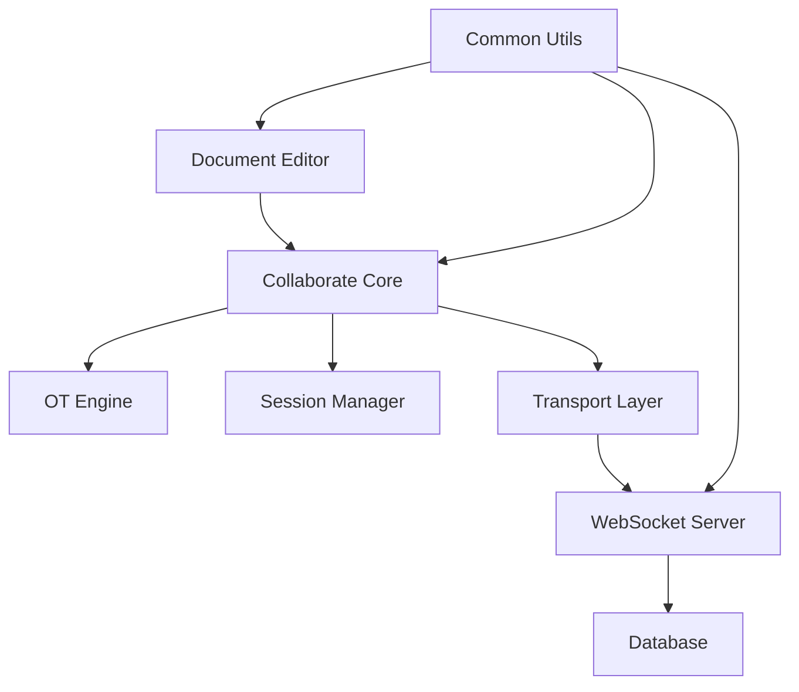

# delta-ot

> 基于 Quill Delta 的完整协同编辑系统，实现完整的协同编辑解决方案，并且有完整的测试覆盖。但是这个项目是一个研究学习性质的项目，所以不要直接用于生产环境方案，请谨慎使用。

## 关于项目

这是一个基于 [Quill Delta](https://quilljs.com/guides/designing-the-delta-format/) 的 OT（Operational Transformation）协同编辑系统，实现了完整的实时协同编辑功能。项目采用 Monorepo 架构，包含协同算法核心、文档编辑器、服务端通信等完整模块。

> 💡 **协同编辑方案对比**：如果你对 CRDT（Conflict-free Replicated Data Type）方案感兴趣，可以查看我的另一个项目 [butterfly](https://github.com/hzjswlgbsj/butterfly) - 基于 Yjs 的 CRDT 协同编辑实现。两个项目分别展示了 OT 和 CRDT 两种不同的协同编辑技术路线。

### 项目特色

- **完整的 OT 算法实现**：基于 Quill Delta 的操作转换算法，支持插入、删除、格式变更等所有编辑操作
- **生产级架构设计**：模块化设计，高内聚低耦合，易于扩展和维护
- **丰富的测试覆盖**：包含 50+ 个测试用例，覆盖所有常见的协同编辑场景
- **完整的文档体系**：每个模块都有详细的设计文档和实现说明
- **实时协同能力**：支持多用户实时编辑，自动解决冲突
- **技术路线对比**：与 [butterfly](https://github.com/hzjswlgbsj/butterfly) 项目形成 OT vs CRDT 的完整技术对比

### 系统架构



## 包结构详解

### `@delta-ot/collaborate` - 协同算法核心

协同编辑的核心算法模块，提供纯逻辑的 OT 实现，无 UI 依赖。

#### 核心功能

- **OT 引擎**：实现操作转换算法，解决并发编辑冲突
- **会话管理**：管理用户编辑会话，处理本地和远程操作
- **文档模型**：基于 Delta 的文档状态管理
- **传输层**：WebSocket 通信封装

#### 目录结构

```bash
collaborate/
├── engine/           # OT 引擎核心算法
│   ├── OTEngine.ts   # 操作转换实现
│   └── README.md     # 引擎设计文档
├── session/          # 协同会话管理
│   ├── OTSession.ts  # 会话控制器
│   └── README.md     # 会话设计文档
├── model/            # 文档模型
│   ├── DocumentModel.ts
│   └── README.md
├── transport/        # 传输层
│   ├── WebSocketClient.ts
│   └── README.md
├── tests/            # 测试用例
│   └── engine/       # OT 算法测试
└── utils/            # 工具函数
```

#### 设计文档

- [OT 引擎架构设计](./packages/collaborate/src/engine/ot-engine.md)
- [会话管理设计](./packages/collaborate/src/session/ot-session.md)
- [传输层设计](./packages/collaborate/src/transport/README.md)
- [Delta 算法原理解析](./packages/collaborate/src/engine/delta-transform-compose-study.md)

#### 开发命令

```bash
cd packages/collaborate
pnpm test          # 运行测试
pnpm test:watch    # 监听模式测试
pnpm build         # 构建包
```

### `@delta-ot/document` - 文档编辑器

基于 Vue 3 + Quill 的现代化文档编辑器，提供完整的协同编辑 UI 体验。

#### 核心功能

- **Quill 编辑器集成**：基于 Quill 2.0 的富文本编辑器
- **协同编辑 UI**：实时显示多用户编辑状态
- **测试实验室**：内置协同编辑测试框架
- **用户管理**：完整的用户登录和权限管理

#### 技术栈

- Vue 3 + TypeScript
- Quill 2.0 编辑器
- Element Plus UI 组件
- Tailwind CSS 样式
- Pinia 状态管理

#### 目录结构

```bash
document/
├── src/
│   ├── components/     # Vue 组件
│   │   ├── Document/   # 文档组件
│   │   ├── Editor/     # 编辑器组件
│   │   └── ListItem/   # 列表项组件
│   ├── controllers/    # 控制器层
│   │   ├── DocumentManager.ts
│   │   ├── CollaborateController.ts
│   │   └── WebsocketController.ts
│   ├── pages/          # 页面组件
│   ├── test-lab/       # 测试实验室
│   └── store/          # 状态管理
```

#### 开发命令

```bash
cd packages/document
pnpm dev          # 启动开发服务器
```

### `service` - 服务端

基于 Node.js + Koa 的协同编辑服务端，提供 WebSocket 通信和 HTTP API。

#### 核心功能

- **WebSocket 服务**：实时协同编辑通信
- **文档会话管理**：多文档并发编辑支持
- **用户认证**：JWT 认证和权限管理
- **数据持久化**：MySQL 数据库存储

#### 技术栈

- Node.js + TypeScript
- Koa 框架
- MySQL + Sequelize ORM
- Redis 缓存
- WebSocket 通信

#### 目录结构

```bash
service/
├── src/
│   ├── controllers/    # 控制器
│   ├── sessions/       # 文档会话管理
│   ├── socket/         # WebSocket 处理
│   ├── db/            # 数据库模型
│   └── middleware/    # 中间件
```

#### 开发命令

```bash
cd packages/service
pnpm dev          # 启动开发服务器
```

### `common` - 通用工具

项目通用工具包，提供日志系统等基础功能。

#### 核心功能

- **全局日志系统**：支持多客户端、多级别的日志管理
- **工具函数**：项目通用的工具函数

#### 设计文档

- [日志系统设计](./packages/common/src/utils/Logger.md)

## 快速开始

### 环境要求

- Node.js >= 18
- pnpm >= 8
- MySQL >= 8.0
- Redis >= 6.0

## TODO - 协同编辑功能完善计划

> 本项目当前是一个研究学习性质的项目，以下是将其发展为实用的协同编辑系统需要完成的核心功能清单。

### 协同编辑体验优化（最高优先级）

#### 协同功能增强

- [x] 基础实时协同编辑
- [x] 多用户同时编辑
- [x] 实时光标显示
  - [x] 其他用户光标位置显示
  - [x] 用户头像和名称标识
  - [x] 光标颜色区分不同用户
- [ ] 用户在线状态
  - [ ] 在线用户列表显示
  - [ ] 用户进入/离开提示
  - [ ] 用户编辑状态指示
- [ ] 协同反馈
  - [ ] 操作状态提示
  - [ ] 冲突解决提示
  - [ ] 网络状态指示
- [ ] 编辑历史追踪
  - [ ] 实时编辑历史显示
  - [ ] 操作回放功能

#### 富文本编辑器增强

- [x] 基础富文本编辑
- [ ] Markdown语法支持
  - [ ] 实时Markdown预览
  - [ ] 语法自动转换
  - [ ] 快捷键支持
- [ ] 高级内容格式
  - [ ] 表格编辑和格式化
  - [ ] 图片插入、拖拽、调整
  - [ ] 视频嵌入支持
  - [ ] 代码块语法高亮
  - [ ] 数学公式编辑
- [ ] 编辑器插件
  - [ ] 表情符号选择器
  - [ ] 颜色选择器
  - [ ] 字体和字号选择
  - [ ] 对齐方式工具
- [ ] 智能编辑功能
  - [ ] 自动保存
  - [ ] 拼写检查
  - [ ] 智能提示
  - [ ] 格式化助手

### 用户体验提升

#### 界面优化

- [x] 基础编辑器界面
- [ ] 界面改进
  - [ ] 响应式设计
  - [ ] 深色模式支持
- [ ] 移动端适配
  - [ ] 移动端编辑器
  - [ ] 触摸操作优化

#### 交互体验

- [x] 基础协同编辑
- [ ] 实时反馈
  - [ ] 操作状态提示
  - [ ] 冲突解决提示
  - [ ] 网络状态指示
- [ ] 快捷操作
  - [ ] 快捷键支持
  - [ ] 右键菜单

### 系统优化

#### 性能优化

- [x] 基础OT算法实现
- [ ] 大规模文档支持
  - [ ] 文档分片加载
  - [ ] 懒加载优化
  - [ ] 内存使用优化
- [ ] 网络优化
  - [ ] 操作压缩
  - [ ] 增量同步
  - [ ] 断线重连优化

#### 安全加固

- [x] 基础JWT认证
- [ ] 基础安全
  - [ ] 信令加密
  - [ ] 敏感信息保护

#### 日志系统

- [x] 基础日志系统
- [ ] 日志完善
  - [ ] 操作日志记录
  - [ ] 错误日志记录

### 文档管理功能（后期完善）

#### 文档管理

- [x] 基础文档创建和编辑
- [ ] 文档版本管理
  - [ ] 版本历史记录
  - [ ] 版本回滚功能
  - [ ] 版本对比功能
- [ ] 文档导入导出
  - [ ] Markdown导入导出
  - [ ] 纯文本导入导出

#### 用户权限管理

- [x] 基础用户登录注册
- [ ] 基础权限控制
  - [ ] 文档所有者权限
  - [ ] 编辑权限
  - [ ] 只读权限
- [ ] 邀请和分享
  - [ ] 链接分享功能
  - [ ] 分享链接权限控制

### 优先级

#### 第一阶段（协同体验优化）

1. 实时光标显示和用户状态
2. Markdown语法支持
3. 高级内容格式（表格、图片、视频、代码块）
4. 编辑器插件和智能功能

#### 第二阶段（界面体验）

1. 界面改进（响应式、深色模式）
2. 移动端适配
3. 快捷操作（快捷键、右键菜单）
4. 协同反馈优化

#### 第三阶段（系统完善）

1. 性能优化（大规模文档支持）
2. 日志完善
3. 安全加固

#### 第四阶段（管理功能）

1. 文档版本管理
2. 基础权限控制
3. 文档导入导出
4. 链接分享功能

### 安装依赖

```bash
# 安装 pnpm
npm install -g pnpm

# 克隆项目
git clone https://github.com/hzjswlgbsj/delta-ot.git
cd delta-ot

# 安装依赖
pnpm install
```

### 数据库配置

```bash
# 导入数据库结构
mysql -u root -p < delta_ot_document.sql

# 配置环境变量
cp .env.example .env
# 编辑 .env 文件，配置数据库连接信息
```

### 启动服务

```bash
# 启动服务端
cd packages/service
pnpm dev

# 启动前端（新终端）
cd packages/document
pnpm dev
```

## 测试与验证

### OT 算法测试

项目包含完整的 OT 算法测试套件，覆盖所有协同编辑场景：

```bash
cd packages/collaborate
pnpm test
```

#### 测试用例分类

- **基础操作测试**：插入、删除、格式变更
- **冲突解决测试**：并发编辑冲突处理
- **复杂场景测试**：多用户、多操作组合
- **边界情况测试**：特殊位置和格式处理

详细测试用例说明：[transform-cases.md](./packages/collaborate/src/tests/engine/transform-cases.md)

### 协同编辑测试实验室

前端内置了完整的协同编辑测试框架：

1. 访问 `/test-lab` 页面
2. 选择测试用例
3. 观察多客户端协同编辑效果
4. 验证最终一致性

测试实验室说明：[测试实验室文档](./packages/document/src/test-lab/collab/README.md)

## 学习资源

### API 文档

- **Postman 集合**：[Delta Document API](https://web.postman.co/workspace/delta-document~38d59294-0648-49c8-ac66-b81e069ef322/collection/1689811-14646b5b-7698-4787-b7ac-d9684a390880?action=share&source=copy-link&creator=1689811)
  
  > 📧 **访问说明**：Postman 集合需要提供邮箱联系我手动邀请。如需访问，请联系我：[联系页面](https://sixtyden.com/#/ABOUT?id=%f0%9f%92%8c-reach-me)

### 核心概念

- [OT 算法原理](./packages/collaborate/src/engine/delta-transform-compose-study.md)
- [协同编辑架构设计](./Architecture.md)
- [WebSocket 信令设计](./packages/collaborate/src/transport/signaling-design.md)
- [光标同步协议设计](./packages/collaborate/src/transport/cursor-sync-design.md)
- [光标渲染器设计](./packages/document/src/components/cursor-renderer-design.md)

### 技术路线对比

- **OT 方案**：本项目 - 基于 Quill Delta 的操作转换算法
- **CRDT 方案**：[butterfly](https://github.com/hzjswlgbsj/butterfly) - 基于 Yjs 的无冲突复制数据类型

### 各模块职责说明

- [OT 引擎开发](./packages/collaborate/src/engine/README.md)
- [会话管理开发](./packages/collaborate/src/session/README.md)
- [传输层开发](./packages/collaborate/src/transport/README.md)

### 测试指南

- [测试用例设计](./packages/collaborate/src/tests/engine/transform-cases.md)
- [测试实验室使用](./packages/document/src/test-lab/collab/README.md)

## 开发指南

### 项目结构

```bash
delta-ot/
├── packages/
│   ├── collaborate/    # 协同算法核心
│   ├── document/       # 文档编辑器
│   ├── service/        # 服务端
│   └── common/         # 通用工具
├── Architecture.md     # 架构设计文档
├── delta_ot_document.sql # 数据库结构
└── README.md          # 项目说明
```

### 建议顺序

1. **理解架构**：阅读 [Architecture.md](./Architecture.md) 了解整体设计
2. **学习算法**：从 [OT 算法原理](./packages/collaborate/src/engine/delta-transform-compose-study.md) 开始
3. **运行测试**：执行测试用例验证理解
4. **修改代码**：基于需求进行开发
5. **添加测试**：为新功能添加测试用例

### 代码规范

- 使用 TypeScript 进行类型安全开发
- 遵循模块化设计原则
- 为每个模块编写详细的设计文档
- 保持测试覆盖率

相关命令请直接查看各模块的 package.json 文件的 scripts 字段。

## 相关项目

- [butterfly](https://github.com/hzjswlgbsj/butterfly) - 基于 CRDT 的协同编辑实现，与本项目形成完整的技术对比

**如果这个项目对你有帮助，请给个 ⭐ Star 鼓励一下！**
