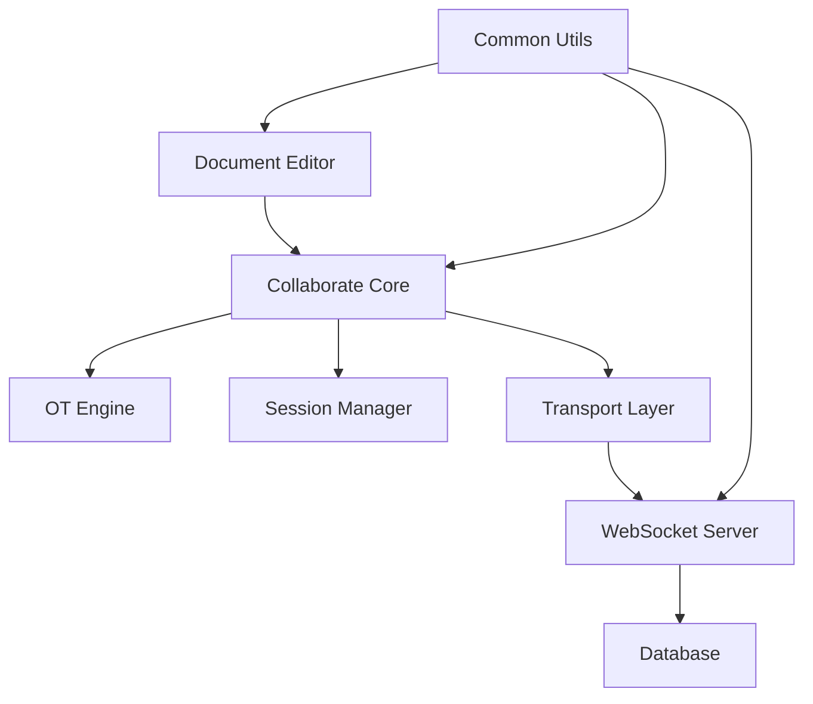

# delta-ot

> 基于 Quill Delta 的完整协同编辑系统，实现完整的协同编辑解决方案，并且有完整的测试覆盖。但是这个项目是一个研究学习性质的项目，所以不要直接用于生产环境方案，请谨慎使用。

## 关于项目

这是一个基于 [Quill Delta](https://quilljs.com/guides/designing-the-delta-format/) 的 OT（Operational Transformation）协同编辑系统，实现了完整的实时协同编辑功能。项目采用 Monorepo 架构，包含协同算法核心、文档编辑器、服务端通信等完整模块。

> 💡 **协同编辑方案对比**：如果你对 CRDT（Conflict-free Replicated Data Type）方案感兴趣，可以查看我的另一个项目 [butterfly](https://github.com/hzjswlgbsj/butterfly) - 基于 Yjs 的 CRDT 协同编辑实现。两个项目分别展示了 OT 和 CRDT 两种不同的协同编辑技术路线。

### 项目特色

- **完整的 OT 算法实现**：基于 Quill Delta 的操作转换算法，支持插入、删除、格式变更等所有编辑操作
- **生产级架构设计**：模块化设计，高内聚低耦合，易于扩展和维护
- **丰富的测试覆盖**：包含 50+ 个测试用例，覆盖所有常见的协同编辑场景
- **完整的文档体系**：每个模块都有详细的设计文档和实现说明
- **实时协同能力**：支持多用户实时编辑，自动解决冲突
- **技术路线对比**：与 [butterfly](https://github.com/hzjswlgbsj/butterfly) 项目形成 OT vs CRDT 的完整技术对比

### 系统架构



## 包结构详解

### `@delta-ot/collaborate` - 协同算法核心

协同编辑的核心算法模块，提供纯逻辑的 OT 实现，无 UI 依赖。

#### 核心功能

- **OT 引擎**：实现操作转换算法，解决并发编辑冲突
- **会话管理**：管理用户编辑会话，处理本地和远程操作
- **文档模型**：基于 Delta 的文档状态管理
- **传输层**：WebSocket 通信封装

#### 目录结构

```bash
collaborate/
├── engine/           # OT 引擎核心算法
│   ├── OTEngine.ts   # 操作转换实现
│   └── README.md     # 引擎设计文档
├── session/          # 协同会话管理
│   ├── OTSession.ts  # 会话控制器
│   └── README.md     # 会话设计文档
├── model/            # 文档模型
│   ├── DocumentModel.ts
│   └── README.md
├── transport/        # 传输层
│   ├── WebSocketClient.ts
│   └── README.md
├── tests/            # 测试用例
│   └── engine/       # OT 算法测试
└── utils/            # 工具函数
```

#### 设计文档

- [OT 引擎架构设计](./packages/collaborate/src/engine/ot-engine.md)
- [会话管理设计](./packages/collaborate/src/session/ot-session.md)
- [传输层设计](./packages/collaborate/src/transport/README.md)
- [Delta 算法原理解析](./packages/collaborate/src/engine/delta-transform-compose-study.md)

#### 开发命令

```bash
cd packages/collaborate
pnpm test          # 运行测试
pnpm test:watch    # 监听模式测试
pnpm build         # 构建包
```

### `@delta-ot/document` - 文档编辑器

基于 Vue 3 + Quill 的现代化文档编辑器，提供完整的协同编辑 UI 体验。

#### 核心功能

- **Quill 编辑器集成**：基于 Quill 2.0 的富文本编辑器
- **协同编辑 UI**：实时显示多用户编辑状态
- **测试实验室**：内置协同编辑测试框架
- **用户管理**：完整的用户登录和权限管理

#### 技术栈

- Vue 3 + TypeScript
- Quill 2.0 编辑器
- Element Plus UI 组件
- Tailwind CSS 样式
- Pinia 状态管理

#### 目录结构

```bash
document/
├── src/
│   ├── components/     # Vue 组件
│   │   ├── Document/   # 文档组件
│   │   ├── Editor/     # 编辑器组件
│   │   └── ListItem/   # 列表项组件
│   ├── controllers/    # 控制器层
│   │   ├── DocumentManager.ts
│   │   ├── CollaborateController.ts
│   │   └── WebsocketController.ts
│   ├── pages/          # 页面组件
│   ├── test-lab/       # 测试实验室
│   └── store/          # 状态管理
```

#### 开发命令

```bash
cd packages/document
pnpm dev          # 启动开发服务器
```

### `service` - 服务端

基于 Node.js + Koa 的协同编辑服务端，提供 WebSocket 通信和 HTTP API。

#### 核心功能

- **WebSocket 服务**：实时协同编辑通信
- **文档会话管理**：多文档并发编辑支持
- **用户认证**：JWT 认证和权限管理
- **数据持久化**：MySQL 数据库存储

#### 技术栈

- Node.js + TypeScript
- Koa 框架
- MySQL + Sequelize ORM
- Redis 缓存
- WebSocket 通信

#### 目录结构

```bash
service/
├── src/
│   ├── controllers/    # 控制器
│   ├── sessions/       # 文档会话管理
│   ├── socket/         # WebSocket 处理
│   ├── db/            # 数据库模型
│   └── middleware/    # 中间件
```

#### 开发命令

```bash
cd packages/service
pnpm dev          # 启动开发服务器
```

### `common` - 通用工具

项目通用工具包，提供日志系统等基础功能。

#### 核心功能

- **全局日志系统**：支持多客户端、多级别的日志管理
- **工具函数**：项目通用的工具函数

#### 设计文档

- [日志系统设计](./packages/common/src/utils/Logger.md)

## 快速开始

### 环境要求

- Node.js >= 18
- pnpm >= 8
- MySQL >= 8.0
- Redis >= 6.0

## TODO - 协同编辑功能完善计划

> 本项目当前是一个研究学习性质的项目，以下是将其发展为实用的协同编辑系统需要完成的核心功能清单。

### 协同编辑体验优化（最高优先级）

#### 协同功能增强

- [x] 基础实时协同编辑
- [x] 多用户同时编辑
- [x] 实时光标显示
  - [x] 其他用户光标位置显示
  - [x] 用户头像和名称标识
  - [x] 光标颜色区分不同用户
- [ ] 用户在线状态
  - [ ] 在线用户列表显示
  - [ ] 用户进入/离开提示
  - [ ] 用户编辑状态指示
  - [ ] 用户头像和在线状态图标
  - [ ] 实时用户数量统计
  - [ ] 用户最后活跃时间显示
- [ ] 协同反馈
  - [ ] 操作状态提示
  - [ ] 冲突解决提示
  - [ ] 网络状态指示
  - [ ] 实时操作同步状态
  - [ ] 网络延迟和连接质量指示
  - [ ] 协同编辑冲突解决动画
  - [ ] 操作成功/失败状态反馈
- [ ] 编辑历史追踪
  - [ ] 实时编辑历史显示
  - [ ] 操作回放功能

#### 富文本编辑器增强

- [x] 基础富文本编辑
- [ ] 编辑器基础能力保障
  - [ ] 撤销重做系统
    - [ ] 协同编辑撤销重做
    - [ ] 操作历史管理
    - [ ] 撤销重做状态同步
    - [ ] 撤销重做快捷键支持
    - [ ] 撤销重做操作合并
  - [ ] 复制粘贴系统
    - [ ] 剪贴板数据格式处理
    - [ ] 富文本格式保持
    - [ ] 纯文本格式转换
    - [ ] 图片复制粘贴支持
    - [ ] 表格复制粘贴支持
    - [ ] 跨应用复制粘贴兼容
  - [ ] 剪贴板管理基础设施
    - [ ] 剪贴板数据解析器
    - [ ] 格式转换器
    - [ ] 剪贴板历史记录
    - [ ] 剪贴板数据验证
    - [ ] 剪贴板权限管理
  - [ ] 选择操作优化
    - [ ] 文本选择优化
    - [ ] 跨元素选择支持
    - [ ] 选择范围同步
    - [ ] 选择操作撤销
- [ ] 自定义Toolbar系统
  - [ ] 基础Toolbar框架
    - [ ] Toolbar组件架构设计
    - [ ] 按钮组件系统
    - [ ] 下拉菜单组件
    - [ ] 颜色选择器组件
    - [ ] 字体选择器组件
    - [ ] 字号选择器组件
    - [ ] 对齐方式选择器
    - [ ] 列表样式选择器
  - [ ] 高级Toolbar功能
    - [ ] 表格操作工具栏
      - [ ] 表格插入和删除
      - [ ] 行列增删操作
      - [ ] 单元格合并拆分
      - [ ] 表格样式设置
    - [ ] 图片操作工具栏
      - [ ] 图片大小调整
      - [ ] 图片对齐方式
      - [ ] 图片环绕设置
      - [ ] 图片滤镜效果
    - [ ] 代码块工具栏
      - [ ] 语言选择器
      - [ ] 代码主题切换
      - [ ] 行号显示控制
      - [ ] 代码复制功能
    - [ ] 数学公式工具栏
      - [ ] LaTeX公式编辑器
      - [ ] 常用符号快捷输入
      - [ ] 公式模板库
      - [ ] 公式预览功能
  - [ ] Toolbar定制化
    - [ ] 工具栏布局自定义
    - [ ] 按钮显示隐藏控制
    - [ ] 快捷键自定义配置
    - [ ] 工具栏主题样式
    - [ ] 移动端工具栏适配
    - [ ] 工具栏状态持久化
  - [ ] 智能Toolbar
    - [ ] 上下文感知工具栏
    - [ ] 智能按钮推荐
    - [ ] 常用操作快捷访问
    - [ ] 工具栏使用统计
    - [ ] 个性化工具栏推荐
- [ ] Markdown语法支持
  - [ ] 实时Markdown预览
  - [ ] 语法自动转换
  - [ ] 快捷键支持
  - [ ] 常用Markdown语法快捷输入
  - [ ] 代码块语法高亮支持
  - [ ] 数学公式LaTeX语法支持
  - [ ] 表格Markdown语法支持
  - [ ] 任务列表语法支持
  - [ ] 脚注和引用语法支持
- [ ] 高级内容格式
  - [ ] 表格编辑和格式化
    - [ ] 基础表格创建和编辑
    - [ ] 表格行列增删操作
    - [ ] 表格样式和边框设置
    - [ ] 表格数据排序和筛选
    - [ ] 表格单元格合并和拆分
  - [ ] 图片插入、拖拽、调整
    - [ ] 拖拽上传图片功能
    - [ ] 图片大小调整和裁剪
    - [ ] 图片对齐和环绕设置
    - [ ] 图片压缩和格式转换
    - [ ] 图片库管理和复用
  - [ ] 视频嵌入支持
    - [ ] 本地视频文件上传
    - [ ] 在线视频链接嵌入
    - [ ] 视频播放控制设置
    - [ ] 视频缩略图生成
  - [ ] 代码块语法高亮
    - [ ] 多语言语法高亮支持
    - [ ] 代码块主题切换
    - [ ] 代码行号显示
    - [ ] 代码复制功能
  - [ ] 数学公式编辑
    - [ ] LaTeX公式编辑器
    - [ ] 常用数学符号快捷输入
    - [ ] 公式预览和渲染
    - [ ] 公式编号和引用
- [ ] 编辑器插件
  - [ ] 表情符号选择器
    - [ ] 常用表情符号库
    - [ ] 表情符号搜索功能
    - [ ] 最近使用表情记录
  - [ ] 颜色选择器
    - [ ] 颜色拾取器
    - [ ] 预设颜色主题
    - [ ] 自定义颜色保存
  - [ ] 字体和字号选择
    - [ ] 系统字体列表
    - [ ] 字号大小调节
    - [ ] 字体预览功能
  - [ ] 对齐方式工具
    - [ ] 文本对齐方式
    - [ ] 图片对齐方式
    - [ ] 表格对齐方式
  - [ ] 链接管理工具
    - [ ] 链接插入和编辑
    - [ ] 链接预览功能
    - [ ] 链接有效性检查
  - [ ] 引用和脚注工具
    - [ ] 引用内容插入
    - [ ] 脚注自动编号
    - [ ] 引用列表管理
- [ ] 智能编辑功能
  - [ ] 自动保存
    - [ ] 实时自动保存
    - [ ] 保存状态指示
    - [ ] 离线编辑支持
    - [ ] 恢复未保存内容
  - [ ] 拼写检查
    - [ ] 实时拼写检查
    - [ ] 拼写错误高亮
    - [ ] 拼写建议和纠正
    - [ ] 自定义词典支持
  - [ ] 智能提示
    - [ ] 代码补全提示
    - [ ] 链接智能补全
    - [ ] 表情符号智能提示
    - [ ] 常用短语快捷输入
  - [ ] 格式化助手
    - [ ] 自动格式化代码
    - [ ] 表格自动对齐
    - [ ] 图片自动优化
    - [ ] 文档结构优化建议
  - [ ] 智能撤销重做
    - [ ] 操作历史记录
    - [ ] 智能操作合并
    - [ ] 撤销重做状态指示

### 用户体验提升

#### 界面优化

- [x] 基础编辑器界面
- [ ] 界面改进
  - [ ] 响应式设计
    - [ ] 桌面端多分辨率适配
    - [ ] 平板端界面优化
    - [ ] 移动端界面适配
    - [ ] 编辑器工具栏响应式布局
  - [ ] 深色模式支持
    - [ ] 主题切换功能
    - [ ] 深色模式样式优化
    - [ ] 编辑器内容深色适配
    - [ ] 系统主题自动跟随
  - [ ] 界面个性化
    - [ ] 编辑器主题自定义
    - [ ] 工具栏布局自定义
    - [ ] 字体和颜色主题
    - [ ] 界面元素大小调节
- [ ] 移动端适配
  - [ ] 移动端编辑器
    - [ ] 移动端专用工具栏
    - [ ] 触摸友好的按钮设计
    - [ ] 移动端手势操作
    - [ ] 虚拟键盘适配
  - [ ] 触摸操作优化
    - [ ] 触摸选择文本优化
    - [ ] 触摸拖拽操作
    - [ ] 触摸缩放和滚动
    - [ ] 触摸长按菜单
  - [ ] 移动端性能优化
    - [ ] 移动端内存优化
    - [ ] 移动端网络优化
    - [ ] 移动端电池优化

#### 交互体验

- [x] 基础协同编辑
- [ ] 实时反馈
  - [ ] 操作状态提示
  - [ ] 冲突解决提示
  - [ ] 网络状态指示
- [ ] 快捷操作
  - [ ] 快捷键支持
    - [ ] 编辑器基础快捷键
    - [ ] 协同编辑快捷键
    - [ ] Markdown语法快捷键
    - [ ] 自定义快捷键配置
  - [ ] 右键菜单
    - [ ] 文本编辑右键菜单
    - [ ] 图片操作右键菜单
    - [ ] 表格操作右键菜单
    - [ ] 链接操作右键菜单
  - [ ] 拖拽操作
    - [ ] 文本拖拽移动
    - [ ] 图片拖拽调整
    - [ ] 表格行列拖拽
    - [ ] 文件拖拽上传

#### 快捷键

- [ ] 快捷键自定义
  - [ ] 编辑器常用操作快捷键
    - [ ] 文本格式化快捷键
    - [ ] 文档操作快捷键
    - [ ] 编辑操作快捷键
  - [ ] 协同编辑相关快捷键
    - [ ] 用户状态查看快捷键
    - [ ] 协同操作快捷键
  - [ ] Markdown格式快捷键
    - [ ] 标题格式快捷键
    - [ ] 列表格式快捷键
    - [ ] 代码格式快捷键
  - [ ] 插件/扩展功能快捷键
    - [ ] 插件功能快捷键
    - [ ] 扩展工具快捷键
  - [ ] 快捷键冲突检测与提示
    - [ ] 快捷键冲突检测
    - [ ] 快捷键冲突解决建议
  - [ ] 快捷键配置导入导出
    - [ ] 快捷键配置保存
    - [ ] 快捷键配置分享
    - [ ] 快捷键配置重置

### 系统优化

#### 性能优化

- [x] 基础OT算法实现
- [ ] 大规模文档支持
  - [ ] 文档分片加载
    - [ ] 按需加载文档内容
    - [ ] 文档分页显示
    - [ ] 虚拟滚动优化
  - [ ] 懒加载优化
    - [ ] 图片懒加载
    - [ ] 组件懒加载
    - [ ] 插件懒加载
  - [ ] 内存使用优化
    - [ ] 内存泄漏检测
    - [ ] 大文档内存优化
    - [ ] 缓存策略优化
  - [ ] 渲染性能优化
    - [ ] 编辑器渲染优化
    - [ ] 协同光标渲染优化
    - [ ] 大文档滚动优化
- [ ] 网络优化
  - [ ] 操作压缩
    - [ ] 操作数据压缩
    - [ ] 传输协议优化
    - [ ] 压缩算法选择
  - [ ] 增量同步
    - [ ] 增量数据同步
    - [ ] 同步状态管理
    - [ ] 同步冲突处理
  - [ ] 断线重连优化
    - [ ] 自动重连机制
    - [ ] 重连状态提示
    - [ ] 离线编辑支持
  - [ ] 网络质量监控
    - [ ] 网络延迟监控
    - [ ] 网络质量指示
    - [ ] 网络问题诊断

#### 安全加固

- [x] 基础JWT认证
- [ ] 基础安全
  - [ ] 信令加密
    - [ ] WebSocket通信加密
    - [ ] 数据传输加密
    - [ ] 加密算法选择
  - [ ] 敏感信息保护
    - [ ] 用户信息保护
    - [ ] 文档内容加密
    - [ ] 访问权限控制
  - [ ] 操作审计
    - [ ] 用户操作日志
    - [ ] 文档修改记录
    - [ ] 安全事件监控
  - [ ] 防攻击措施
    - [ ] 恶意操作检测
    - [ ] 频率限制
    - [ ] 异常行为监控

#### 日志系统

- [x] 基础日志系统
- [ ] 日志完善
  - [ ] 操作日志记录
    - [ ] 用户操作详细记录
    - [ ] 协同编辑操作日志
    - [ ] 文档修改历史记录
  - [ ] 错误日志记录
    - [ ] 系统错误日志
    - [ ] 网络错误日志
    - [ ] 用户操作错误日志
  - [ ] 性能日志记录
    - [ ] 系统性能监控
    - [ ] 网络性能记录
    - [ ] 用户行为分析
  - [ ] 日志分析工具
    - [ ] 日志可视化展示
    - [ ] 日志搜索和过滤
    - [ ] 日志导出功能

### 文档管理功能（后期完善）

#### 文档管理

- [x] 基础文档创建和编辑
- [ ] 文档版本管理
  - [ ] 版本历史记录
    - [ ] 自动版本保存
    - [ ] 手动版本标记
    - [ ] 版本描述和标签
  - [ ] 版本回滚功能
    - [ ] 版本选择回滚
    - [ ] 部分内容回滚
    - [ ] 回滚确认机制
  - [ ] 版本对比功能
    - [ ] 版本差异对比
    - [ ] 变更内容高亮
    - [ ] 变更统计信息
  - [ ] 版本管理工具
    - [ ] 版本树可视化
    - [ ] 版本搜索和过滤
    - [ ] 版本清理和归档
- [ ] 文档导入导出
  - [ ] Markdown导入导出
    - [ ] Markdown文件导入
    - [ ] Markdown格式导出
    - [ ] Markdown语法兼容性
  - [ ] 纯文本导入导出
    - [ ] 纯文本文件导入
    - [ ] 纯文本格式导出
    - [ ] 编码格式处理
  - [ ] 其他格式支持
    - [ ] HTML格式导入导出
    - [ ] Word文档导入
    - [ ] PDF文档导出
  - [ ] 批量导入导出
    - [ ] 批量文档导入
    - [ ] 批量文档导出
    - [ ] 导入导出进度显示

#### 用户权限管理

- [x] 基础用户登录注册
- [ ] 基础权限控制
  - [ ] 文档所有者权限
    - [ ] 文档创建者权限
    - [ ] 文档管理权限
    - [ ] 权限分配权限
  - [ ] 编辑权限
    - [ ] 内容编辑权限
    - [ ] 格式编辑权限
    - [ ] 评论权限
  - [ ] 只读权限
    - [ ] 内容查看权限
    - [ ] 评论查看权限
    - [ ] 历史记录查看权限
  - [ ] 高级权限控制
    - [ ] 细粒度权限设置
    - [ ] 时间限制权限
    - [ ] 操作限制权限
- [ ] 邀请和分享
  - [ ] 链接分享功能
    - [ ] 公开链接分享
    - [ ] 私有链接分享
    - [ ] 链接有效期设置
  - [ ] 分享链接权限控制
    - [ ] 链接访问权限设置
    - [ ] 链接使用统计
    - [ ] 链接安全控制
  - [ ] 用户邀请功能
    - [ ] 邮箱邀请
    - [ ] 用户搜索邀请
    - [ ] 邀请状态管理
  - [ ] 分享管理工具
    - [ ] 分享链接管理
    - [ ] 分享权限管理
    - [ ] 分享活动监控

### 优先级

#### 第一阶段（编辑器基础能力保障）

1. 撤销重做系统优化
2. 复制粘贴系统完善
3. 剪贴板管理基础设施
4. 选择操作优化

**💡 开发建议**：

- **撤销重做系统**：协同编辑环境下的撤销重做需要特殊处理，确保操作一致性
- **复制粘贴系统**：需要处理复杂的格式转换，建立完善的剪贴板管理基础设施
- **剪贴板管理**：作为复制粘贴的基础设施，需要支持多种格式和跨应用兼容
- **选择操作**：优化文本选择和跨元素选择，提升编辑体验

#### 第二阶段（协同体验优化）

1. 实时光标显示和用户状态
2. Markdown语法支持
3. 高级内容格式（表格、图片、视频、代码块）
4. 编辑器插件和智能功能

**💡 开发建议**：

- **用户在线状态**：基于现有WebSocket架构，技术难度适中，用户体验提升明显
- **Markdown支持**：现代文档编辑器标配，建议开发Quill插件实现语法转换
- **表格功能**：优先实现基础表格编辑，再逐步添加格式化功能
- **图片处理**：支持拖拽上传、基础调整，为后续高级功能打基础

#### 第二阶段（界面体验）

1. 界面改进（响应式、深色模式）
2. 移动端适配
3. 快捷操作（快捷键、右键菜单）
4. 协同反馈优化

**💡 开发建议**：

- **响应式设计**：优先适配桌面端不同分辨率，再考虑移动端
- **深色模式**：使用CSS变量实现主题切换，与现有Tailwind CSS集成
- **快捷键系统**：建立统一的快捷键管理机制，支持自定义配置
- **协同反馈**：在现有光标同步基础上，添加操作状态和网络状态提示

#### 第三阶段（系统完善）

1. 性能优化（大规模文档支持）
2. 日志完善
3. 安全加固

**💡 开发建议**：

- **性能优化**：基于现有100+测试用例，识别性能瓶颈，优先优化高频操作
- **日志系统**：扩展现有Logger系统，添加操作审计和错误追踪功能
- **安全加固**：在现有JWT认证基础上，添加操作权限验证和数据加密

#### 第四阶段（管理功能）

1. 文档版本管理
2. 基础权限控制
3. 文档导入导出
4. 链接分享功能

**💡 开发建议**：

- **版本管理**：基于现有数据持久化架构，实现增量版本存储
- **权限控制**：建立细粒度权限模型，支持文档级别的访问控制
- **导入导出**：优先支持Markdown格式，再扩展其他格式
- **分享功能**：实现安全的链接分享机制，支持权限控制

### 🚀 立即开始建议

#### 推荐第一个功能：撤销重做系统优化

**为什么选择这个功能**：

- ✅ **基础能力保障**：撤销重做是编辑器的基础功能，直接影响用户体验
- ✅ **协同编辑特殊性**：协同环境下的撤销重做需要特殊处理，确保操作一致性
- ✅ **技术挑战适中**：基于现有OT算法，需要扩展操作历史管理
- ✅ **用户需求强烈**：撤销重做是用户最常用的基础操作之一

**技术实现要点**：

- 操作历史管理：记录和追踪所有编辑操作
- 协同撤销重做：确保多用户环境下的操作一致性
- 操作合并：智能合并连续的撤销重做操作
- 状态同步：在协同编辑中同步撤销重做状态

#### 推荐第二个功能：复制粘贴系统完善

**为什么选择这个功能**：

- ✅ **基础能力保障**：复制粘贴是编辑器的核心功能，需要处理复杂格式
- ✅ **技术挑战重要**：需要建立完善的剪贴板管理基础设施
- ✅ **跨应用兼容**：需要处理来自不同应用的格式转换
- ✅ **用户体验关键**：复制粘贴的流畅性直接影响编辑效率

**技术实现要点**：

- 剪贴板数据解析：处理HTML、纯文本、图片等多种格式
- 格式转换器：在不同格式间进行转换
- 跨应用兼容：支持从Word、浏览器等应用复制内容
- 剪贴板历史：管理剪贴板历史记录

#### 推荐第三个功能：用户在线状态

**为什么选择这个功能**：

- ✅ **技术基础扎实**：基于现有WebSocket架构，开发难度适中
- ✅ **用户体验提升明显**：用户能看到谁在线、谁在编辑，增强协同感
- ✅ **为后续功能打基础**：为权限管理、实时通知等功能做准备
- ✅ **开发周期短**：预计1-2周可完成MVP版本

**技术实现要点**：

- 服务端：扩展WebSocket消息类型，维护在线用户列表
- 前端：创建在线用户列表组件，实时更新用户状态
- 状态管理：在Pinia store中管理在线用户状态

#### 推荐第二个功能：Markdown语法支持

**为什么选择这个功能**：

- ✅ **现代编辑器标配**：提升编辑器的实用性和竞争力
- ✅ **用户需求强烈**：Markdown是文档编辑的主流格式
- ✅ **技术实现清晰**：可开发Quill插件实现语法转换
- ✅ **渐进式开发**：先实现基础语法，再逐步完善

**技术实现要点**：

- Quill插件开发：Markdown语法解析和转换
- 实时预览：支持边写边预览模式
- 快捷键支持：常用Markdown语法的快捷键

#### 推荐第三个功能：表格编辑

**为什么选择这个功能**：

- ✅ **实用性高**：表格是文档编辑的重要需求
- ✅ **技术挑战适中**：基于Quill的表格模块扩展
- ✅ **协同效果好**：多用户同时编辑表格的协同体验
- ✅ **为复杂功能打基础**：为后续图片、视频等功能积累经验

### 📋 开发原则

#### 1. 模块化开发

- 保持现有的模块化架构
- 每个新功能都应该是独立的模块
- 遵循高内聚低耦合的设计原则

#### 2. 测试驱动

- 为新功能编写测试用例
- 确保现有测试覆盖率不降低
- 在测试实验室中添加新功能的测试场景

#### 3. 渐进式增强

- 先实现核心功能，再逐步添加高级特性
- 保持向后兼容性
- 避免过度复杂化

#### 4. 用户体验优先

- 优先实现用户感知明显的功能
- 注重交互细节和视觉反馈
- 保持界面的一致性和简洁性

#### 5. 基础能力优先

- 优先保障编辑器的基础功能（撤销重做、复制粘贴等）
- 确保基础功能的稳定性和一致性
- 在基础能力完善后再进行功能扩展

### 安装依赖

```bash
# 安装 pnpm
npm install -g pnpm

# 克隆项目
git clone https://github.com/hzjswlgbsj/delta-ot.git
cd delta-ot

# 安装依赖
pnpm install
```

### 数据库配置

```bash
# 导入数据库结构
mysql -u root -p < delta_ot_document.sql

# 配置环境变量
cp .env.example .env
# 编辑 .env 文件，配置数据库连接信息
```

### 启动服务

```bash
# 启动服务端
cd packages/service
pnpm dev

# 启动前端（新终端）
cd packages/document
pnpm dev
```

## 测试与验证

### OT 算法测试

项目包含完整的 OT 算法测试套件，覆盖所有协同编辑场景：

```bash
cd packages/collaborate
pnpm test
```

#### 测试用例分类

- **基础操作测试**：插入、删除、格式变更
- **冲突解决测试**：并发编辑冲突处理
- **复杂场景测试**：多用户、多操作组合
- **边界情况测试**：特殊位置和格式处理

详细测试用例说明：[transform-cases.md](./packages/collaborate/src/tests/engine/transform-cases.md)

### 协同编辑测试实验室

前端内置了完整的协同编辑测试框架：

1. 访问 `/test-lab` 页面
2. 选择测试用例
3. 观察多客户端协同编辑效果
4. 验证最终一致性

测试实验室说明：[测试实验室文档](./packages/document/src/test-lab/collab/README.md)

## 学习资源

### API 文档

- **Postman 集合**：[Delta Document API](https://web.postman.co/workspace/delta-document~38d59294-0648-49c8-ac66-b81e069ef322/collection/1689811-14646b5b-7698-4787-b7ac-d9684a390880?action=share&source=copy-link&creator=1689811)
  
  > 📧 **访问说明**：Postman 集合需要提供邮箱联系我手动邀请。如需访问，请联系我：[联系页面](https://sixtyden.com/#/ABOUT?id=%f0%9f%92%8c-reach-me)

### 核心概念

- [OT 算法原理](./packages/collaborate/src/engine/delta-transform-compose-study.md)
- [协同编辑架构设计](./Architecture.md)
- [WebSocket 信令设计](./packages/collaborate/src/transport/signaling-design.md)
- [光标同步协议设计](./packages/collaborate/src/transport/cursor-sync-design.md)
- [光标渲染器设计](./packages/document/src/components/cursor-renderer-design.md)

### 技术路线对比

- **OT 方案**：本项目 - 基于 Quill Delta 的操作转换算法
- **CRDT 方案**：[butterfly](https://github.com/hzjswlgbsj/butterfly) - 基于 Yjs 的无冲突复制数据类型

### 各模块职责说明

- [OT 引擎开发](./packages/collaborate/src/engine/README.md)
- [会话管理开发](./packages/collaborate/src/session/README.md)
- [传输层开发](./packages/collaborate/src/transport/README.md)

### 测试指南

- [测试用例设计](./packages/collaborate/src/tests/engine/transform-cases.md)
- [测试实验室使用](./packages/document/src/test-lab/collab/README.md)

## 开发指南

### 项目结构

```bash
delta-ot/
├── packages/
│   ├── collaborate/    # 协同算法核心
│   ├── document/       # 文档编辑器
│   ├── service/        # 服务端
│   └── common/         # 通用工具
├── Architecture.md     # 架构设计文档
├── delta_ot_document.sql # 数据库结构
└── README.md          # 项目说明
```

### 建议顺序

1. **理解架构**：阅读 [Architecture.md](./Architecture.md) 了解整体设计
2. **学习算法**：从 [OT 算法原理](./packages/collaborate/src/engine/delta-transform-compose-study.md) 开始
3. **运行测试**：执行测试用例验证理解
4. **修改代码**：基于需求进行开发
5. **添加测试**：为新功能添加测试用例

### 代码规范

- 使用 TypeScript 进行类型安全开发
- 遵循模块化设计原则
- 为每个模块编写详细的设计文档
- 保持测试覆盖率

相关命令请直接查看各模块的 package.json 文件的 scripts 字段。

## 相关项目

- [butterfly](https://github.com/hzjswlgbsj/butterfly) - 基于 CRDT 的协同编辑实现，与本项目形成完整的技术对比

**如果这个项目对你有帮助，请给个 ⭐ Star 鼓励一下！**
