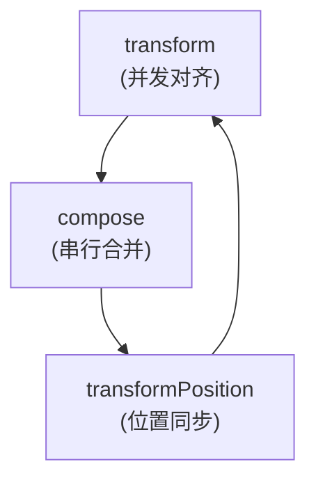
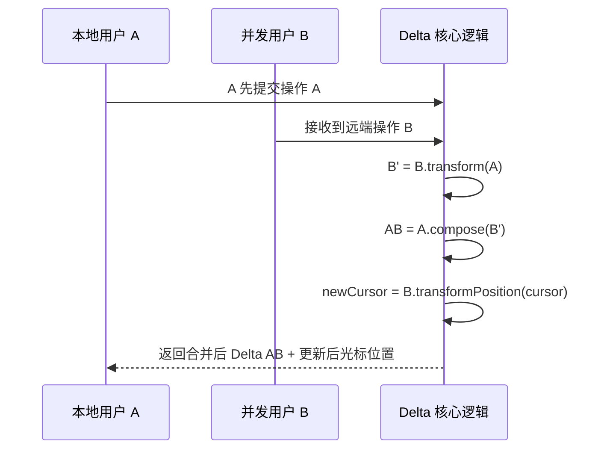
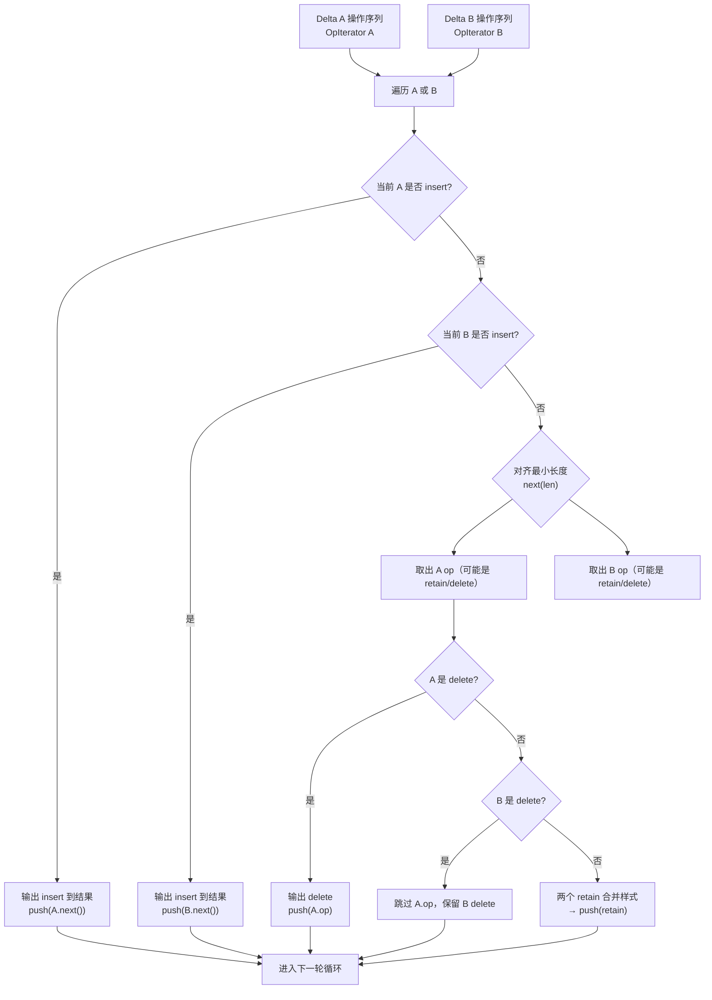

# Delta OT 协同算法原理解析

协同编辑的核心在于多个用户对文档同时操作时，如何将这些操作无冲突地合并成一致结果。Delta 是 Quill 编辑器底层采用的数据结构，它基于一组操作序列（ops）来描述文档变更，并提供 `transform` 和 `compose` 两大方法实现操作合并与冲突消解。

在这篇文档中，我们将从底层实现开始，逐步拆解 Delta 的设计与关键方法，并串联起协同编辑的完整思路。

## 操作迭代器：OpIterator 设计

在深入 `transform` 和 `compose` 实现前，我们先来看一个基础组件：`OpIterator`。

### 为什么需要 OpIterator？

你可能会疑惑，为什么 Delta 不直接用 `forEach` / `map` 来遍历操作数组，而是实现一个自定义迭代器？

答案是：**Delta 的变更过程不是顺序遍历，而是「按需裁切、对齐步进」的复杂处理过程。**

举个例子：

```typescript
[{ retain: 10 }];
```

如果我们需要处理 `retain:10` 和另一个 `retain:4` 的并发情况，就必须将其裁切为：

```typescript
retain:4 + retain:6
```

并在 transform 中逐步推进处理。而这显然不是 `forEach` 等高阶函数能够胜任的。于是，`OpIterator` 就成为了整个 Delta 机制的「操作切片器」。

### OpIterator 的设计目标

| 能力             | 举例                                  | forEach 是否能做到 |
| ---------------- | ------------------------------------- | ------------------ |
| **peekType**     | 查看下一个操作是 insert/retain/delete | ❌ 无法预读        |
| **peekLength**   | 获取下一个操作的剩余可用长度          | ❌ 无法知道        |
| **next(length)** | 取出指定长度的部分操作（可裁切）      | ❌ 无法部分消费    |
| **offset 跟踪**  | 操作未用完时继续留在当前位置处理      | ❌ 只能整条处理    |

接下来我们就来解析 OpIterator 的核心方法 `next()`。

## OpIterator.prototype.next 方法解析

> `next(length?: number): Op`：返回当前 op 的一部分，并推进游标状态。

这个方法的作用是：

> **从当前操作中「消费」一段 `length` 长度的内容，返回这段切片，并自动推进状态游标。**

它是 Delta transform 中对齐机制的核心。

### 核心特性

- 支持操作的 **部分裁切**
- 自动推进 **index / offset** 状态
- 支持多种类型：`insert`、`retain`、`delete`
- 返回值始终是标准化的 `Op` 对象

### 内部状态说明

| 属性          | 含义                                                        |
| ------------- | ----------------------------------------------------------- |
| `this.ops`    | 当前 Delta 的操作列表                                       |
| `this.index`  | 当前正在处理第几个操作（数组下标）                          |
| `this.offset` | 当前 op 已处理的偏移量（如 insert:"hello" 已处理前 2 个字） |

### 源码解析（带详细注释）

```typescript
/**
 * 返回当前操作的一部分或完整内容，并自动推进迭代器的游标状态。
 *
 * 在 Delta 的 transform 或 compose 过程中，需要对操作（op）进行**按字符级别**的消费与对齐处理。
 * 因此不能简单地一次性处理完整 op，而需要「切片式」地逐步消费操作内容。
 *
 * 例如：
 * - 当前 op 为 `{ retain: 10 }`，调用 `next(4)` 会返回 `{ retain: 4 }`，并留下剩余 `{ retain: 6 }`。
 * - 当前 op 为 `{ insert: "hello" }`，`offset = 2`，调用 `next(2)` 会返回 `{ insert: "ll" }`。
 *
 * ### 特性说明：
 * - 支持 insert、retain、delete 三种类型；
 * - 支持部分消费（裁切），并自动更新 offset；
 * - 返回始终为合法的 Delta Op 结构；
 * - 对于不可裁切的嵌入（如 image embed），仅允许整块返回。
 *
 * @param length - 要消费的最大长度，默认 Infinity 表示完整消费当前 op。
 * @returns 标准化的 Op 片段，类型可能为 `{ insert }`、`{ retain }` 或 `{ delete }`。
 *          若所有操作已消费完，返回 `{ retain: Infinity }` 作为虚拟终止占位。
 */
next(length?: number): Op {
  // 如果没有指定 length，默认消耗无限长（即整个 op）
  if (!length) {
    length = Infinity;
  }

  const nextOp = this.ops[this.index];

  // 如果还有操作未遍历完
  if (nextOp) {
    const offset = this.offset;
    const opLength = Op.length(nextOp);

    // 如果 length 足以消费剩下的整个 op，推进到下一个 op
    if (length >= opLength - offset) {
      length = opLength - offset;
      this.index += 1;
      this.offset = 0;
    } else {
      // 否则只推进 offset，保留当前 op 供下一轮继续消费
      this.offset += length;
    }

    // === delete 类型处理 ===
    if (typeof nextOp.delete === 'number') {
      return { delete: length };
    }

    // === retain/insert 类型处理 ===
    const retOp: Op = {};

    if (nextOp.attributes) {
      retOp.attributes = nextOp.attributes;
    }

    if (typeof nextOp.retain === 'number') {
      // retain:number，可以被部分消费
      retOp.retain = length;
    } else if (typeof nextOp.retain === 'object' && nextOp.retain !== null) {
      // retain:object 是嵌入内容（如图片），必须整体处理，不能切
      // 此时 offset 必须是 0，length == 1
      retOp.retain = nextOp.retain;
    } else if (typeof nextOp.insert === 'string') {
      // insert:string 可按字符切片处理
      retOp.insert = nextOp.insert.substr(offset, length);
    } else {
      // insert:object（嵌入内容），不能切，必须整体返回
      // 此时 offset 必须是 0，length == 1
      retOp.insert = nextOp.insert;
    }

    return retOp;
  } else {
    // 如果操作序列已经结束，默认返回一个无限 retain
    // 表示“什么都不做，但保持位置向前推进”
    return { retain: Infinity };
  }
}
```

### 不同类型操作的切片策略

| 类型                       | 是否可切片 | 切片方式说明                                            |
| -------------------------- | ---------- | ------------------------------------------------------- |
| `delete: 10`               | ✅         | → `{ delete: length }`                                  |
| `retain: 8`                | ✅         | → `{ retain: length }`                                  |
| `retain: {}`               | ❌         | → 只能完整返回对象，不可裁切                            |
| `insert: "abcde"`          | ✅         | → `{ insert: "ab" }` 由 offset 和 length 控制字符串截取 |
| `insert: { image: "..." }` | ❌         | → 必须整体返回，offset 必须为 0，length 必须为 1        |

### 示例解析

#### 示例 1：insert 字符串切片

```typescript
this.ops = [{ insert: "hello" }];
this.offset = 2;
next(2) → { insert: "ll" }
```

#### 示例 2：delete 分段处理

```typescript
this.ops = [{ delete: 10 }];
next(4) → { delete: 4 }
next(6) → { delete: 6 }
```

#### 示例 3：嵌入内容（embed）不可裁切

```typescript
this.ops = [{ insert: { image: "url" } }];
next(1) → { insert: { image: "url" } }
next(2) → ❌ 错误！嵌入对象不允许裁切
```

### 裁切与游标推进逻辑总结

```typescript
if (length >= opLength - offset) {
  // 当前这段被完整消费，进入下一个 op
  this.index += 1;
  this.offset = 0;
} else {
  // 只消耗一部分，下轮继续处理同一个 op
  this.offset += length;
}
```

### 总结

| 功能             | 是否支持 | 说明                                     |
| ---------------- | -------- | ---------------------------------------- | ------ | ---------------------- |
| 部分裁切操作     | ✅       | 支持 insert、retain、delete 的按需切片   |
| 嵌入操作不可拆分 | ✅       | insert/retain 的 object 类型要求整体返回 |
| 自动游标推进     | ✅       | `index` 和 `offset` 会被自动维护         |
| 标准化返回       | ✅       | 始终返回 `{ insert                       | retain | delete, attributes? }` |

### 本质一句话总结

> **OpIterator.next 就是 Delta 的“切片器”：你告诉它每次走多远，它就精确返回这一小段，并自动帮你记住下次从哪继续。**

### transform 不再是状态地狱

如果你用 `forEach` / `map` 来 transform 两个 Delta，你会写出这样的代码：

```typescript
opsA.forEach((opA) => {
  opsB.forEach((opB) => {
    // opA 比 opB 长，怎么办？谁偏移了？要拆吗？退回吗？
  });
});
```

很快你会陷入各种 offsetA、offsetB、cursorA、remainingB 状态变量。

而 OpIterator + next(length) 则完全摆脱这些状态管理：

```typescript
while (iterA.hasNext() || iterB.hasNext()) {
  const len = Math.min(iterA.peekLength(), iterB.peekLength());
  const a = iterA.next(len);
  const b = iterB.next(len);
  // 一轮对齐处理
}
```

> **结构清晰、无副作用、无需状态堆积，transform 实现逻辑简洁优雅。**

## Delta.prototype.transform 方法解析

在拥有了 `OpIterator` 的切片能力之后，我们就可以进入 Delta 最核心的算法逻辑：`transform`。

`transform` 的职责是：

> **将一个 Delta 调整为在另一个 Delta 变更后的文档上可以正确应用的版本。**

这在协同编辑中至关重要 —— 假设两个用户同时操作文档，它们各自的操作必须相互调整，以免内容错乱或丢失。

### 整体处理逻辑

在进入源码前，先明确一下 transform 的整体流程：

> 遍历 thisDelta 和 otherDelta 中的 op，逐个对齐处理，生成一个新的 Delta，它能「在 otherDelta 修改过的文档」上应用 thisDelta 的效果。

整个遍历逻辑可以拆分成三大分支：

1. **🟢 this 是 insert**

   - 如果当前 op 是 thisDelta 的 insert，并且具有优先权，则直接 retain（因为内容已经插入过，光标需要偏移）

2. **🔵 other 是 insert**

   - 如果对方插入内容，则将其加入结果中（插入内容不冲突，应该保留）

3. **🟡 双方都不是 insert**
   - 通常是 retain 或 delete，对齐处理每一小段，判断谁删除、谁保留、谁需要合并样式/嵌入

### 方法签名

```typescript
transform(index: number, priority?: boolean): number;
transform(other: Delta, priority?: boolean): Delta;
```

支持传入数字（光标位置）或另一个 Delta，分别进行位置转换或操作转换。我们这里关注的是第二种：**Delta 对 Delta 的 transform**。

### 源码 + 注释

```typescript
/**
 * 将一个操作转化为另一个操作，以便于实现实时协同编辑。
 * 规则：
 *  - 如果当前操作是插入并且具有优先级，则保留位置以移动光标。
 *  - 如果其他操作是插入，则直接将操作插入到结果中。
 *  - 如果两个操作都是删除或保留，则取最小长度并对齐操作。
 *  - 如果两个操作都是保留，则合并保留长度和属性（样式）。
 *
 * @param arg - 要转化的操作，可以是数字索引或 Delta 对象。
 * @param priority - 转化的优先级，默认为 false。
 * @returns 转化后的操作，可以是数字索引或 Delta 对象。
 */
transform(arg: number | Delta, priority = false): typeof arg {
  priority = !!priority;

  // 如果传入的是数字，则走 transformPosition
  if (typeof arg === 'number') {
    return this.transformPosition(arg, priority);
  }

  const other: Delta = arg;

  const thisIter = new OpIterator(this.ops);   // 当前 Delta
  const otherIter = new OpIterator(other.ops); // 并发 Delta
  const delta = new Delta();                   // 最终结果

  while (thisIter.hasNext() || otherIter.hasNext()) {
    // 🟢 分支 1：this 是 insert
    if (
      thisIter.peekType() === 'insert' &&
      (priority || otherIter.peekType() !== 'insert')
    ) {
      // 当前拥有插入优先权，插入内容不直接应用，而是将其长度保留（retain），让位
      delta.retain(Op.length(thisIter.next()));
    }

    // 🔵 分支 2：other 是 insert
    else if (otherIter.peekType() === 'insert') {
      // 对方插入内容优先级更高，直接插入到结果中
      delta.push(otherIter.next());
    }

    // 🟡 分支 3：两边都不是 insert（可能是 retain / delete）
    else {
      const length = Math.min(thisIter.peekLength(), otherIter.peekLength());
      const thisOp = thisIter.next(length);
      const otherOp = otherIter.next(length);

      if (thisOp.delete) {
        // 当前是 delete，说明这段内容已经删掉，other 无论 retain 还是 delete 都跳过
        continue;
      }

      if (otherOp.delete) {
        // 对方是 delete，删除操作应该出现在结果中
        delta.push(otherOp);
      }

      // 双方都是 retain，合并嵌入对象、格式样式
      else {
        const thisData = thisOp.retain;
        const otherData = otherOp.retain;

        let transformedData: Op['retain'] =
          typeof otherData === 'object' && otherData !== null
            ? otherData
            : length;

        // 如果双方都是 embed 类型（对象 retain），则尝试合并（交给 handler）
        if (
          typeof thisData === 'object' &&
          thisData !== null &&
          typeof otherData === 'object' &&
          otherData !== null
        ) {
          const embedType = Object.keys(thisData)[0];
          if (embedType === Object.keys(otherData)[0]) {
            const handler = Delta.getHandler(embedType);
            if (handler) {
              transformedData = {
                [embedType]: handler.transform(
                  thisData[embedType],
                  otherData[embedType],
                  priority
                ),
              };
            }
          }
        }

        // 合并属性（格式，如 bold、italic）
        const transformedAttributes = AttributeMap.transform(
          thisOp.attributes,
          otherOp.attributes,
          priority
        );

        delta.retain(transformedData, transformedAttributes);
      }
    }
  }

  return delta.chop(); // 去除尾部多余 retain
}
```

### 逐段说明与背后设计意图

| 位置                           | 说明                                              |
| ------------------------------ | ------------------------------------------------- |
| `if (typeof arg === 'number')` | 支持 transformPosition 的重载形式（光标位置调整） |
| `OpIterator(this.ops)`         | 使用切片迭代器，逐段精细处理                      |
| `this 是 insert`               | 有优先权时插入的是“虚影”，只需要 retain 空间      |
| `other 是 insert`              | 没有优先权时对方插入的内容直接 push               |
| `双方都是 delete/retain`       | 逐段对齐：删除跳过，retain 合并数据/样式          |
| `handler.transform()`          | 可扩展处理富文本嵌入内容（如 mention、图片）      |
| `AttributeMap.transform`       | 样式合并器，支持 bold/italic 等富文本属性冲突合并 |

### 行为逻辑总结表

| 类型           | 行为说明                                                          |
| -------------- | ----------------------------------------------------------------- |
| Insert         | 谁有优先级谁插入，另一个通过 retain 向后偏移                      |
| Delete         | 删除者胜出，被删区域所有其他操作都跳过                            |
| Retain         | 保留基础文本，合并格式、样式或嵌入内容                            |
| 嵌入 transform | 支持自定义类型（如公式、@mention）通过 handler 进行个性化合并处理 |
| chop           | 清理结果末尾多余 retain，使 Delta 更精简                          |

### 使用场景举例

1. **两个用户同时在 index=5 插入文本**

   - 有优先权的人插入在前，另一个通过 `retain(length)` 向后偏移

2. **一个用户删除文本，另一个试图 retain 或修改其属性**

   - 删除者胜出，对方 retain 操作会被跳过

3. **嵌入内容冲突（如修改同一个公式）**
   - 注册 `Delta.getHandler(type)`，由 handler 负责 merge

### 小结

`transform` 是 Quill 协同算法的核心。它的职责就是：

> **将操作 A 重映射到 B 执行后的文档上，让 A 和 B 能“和平共处”。**

整个过程通过：

- 对齐裁切（OpIterator）
- 优先级判断（priority）
- 样式与嵌入合并（AttributeMap / handler）

实现了 OT 算法中「操作之间的相互转化」这一关键能力。

> 一句话总结：**transform 是“操作调解器”，确保多方修改可以在同一文档上无冲突地融合。**

## Delta.prototype.transformPosition 方法解析

在协同编辑中，除了调整操作本身（`transform`），还有一个非常重要的功能 —— **调整光标或位置索引的偏移量**。

这正是 `transformPosition` 方法的职责：

> **将原本位于某个位置的操作或光标，映射到另一组 Delta 操作应用后的新位置。**

### 背景场景说明

协同编辑中，多个用户可能同时操作文档。比如你准备在第 10 个字符插入文本，但在你操作之前，另一位协作者刚刚在前面插入了 3 个字符，那么你真正插入的应是位置 13，而不是 10。

这就要求我们：**根据已经执行过的操作序列，动态调整当前的位置索引。**

### 核心设计思想：三类操作如何影响位置

在 transformPosition 中，我们要重点思考：**每种操作会如何影响 index 的位置？**

| 操作类型         | 位置偏移        | 说明                                     |
| ---------------- | --------------- | ---------------------------------------- |
| `delete`         | 向前偏移（减）  | 删除前面的字符，当前位置需要往前推       |
| `insert`         | 向后偏移（加）  | 插入在 index 前的位置，index 被推后      |
| `insert`（相等） | 取决于 priority | 并发插入，谁拥有优先级，谁插入在前       |
| `retain`         | 不偏移          | 保留字符不影响 index，仅用于判断是否越界 |

### transformPosition 方法签名

```typescript
transformPosition(index: number, priority?: boolean): number
```

| 参数       | 说明                                                         |
| ---------- | ------------------------------------------------------------ |
| `index`    | 当前待调整的位置（如光标或插入点）                           |
| `priority` | 是否拥有并发优先权，影响同时插入时位置是否偏移（默认 false） |
| 返回值     | 应用当前 Delta 后的实际新位置                                |

### 带详细注释的源码解析

```typescript
transformPosition(index: number, priority = false): number {
  priority = !!priority;

  const thisIter = new OpIterator(this.ops);
  let offset = 0;

  while (thisIter.hasNext() && offset <= index) {
    const length = thisIter.peekLength();  // 当前 op 的剩余长度
    const nextType = thisIter.peekType();  // 当前 op 的类型：insert/retain/delete

    thisIter.next(); // 消费当前 op（只用于推进 offset）

    if (nextType === 'delete') {
      // 删除使 index 前移：如果被删除区域在 index 前面或覆盖了 index
      index -= Math.min(length, index - offset);
    }
    else if (nextType === 'insert') {
      // 插入使 index 后移：如果插入发生在 index 前面，或同时发生但我无优先权
      if (offset < index || !priority) {
        index += length;
      }
    }

    offset += length;
  }

  return index;
}
```

### 三大操作对比职责回顾

| 操作类型 | 是否影响 index | 如何影响                                |
| -------- | -------------- | --------------------------------------- |
| delete   | ✅ 向前偏移    | 删除的是 index 之前或包含 index 的内容  |
| insert   | ✅ 向后偏移    | 插入在 index 之前（或同位但我没优先权） |
| retain   | ❌ 不偏移      | 只是跳过已有字符，不影响 index          |

### 示例解析

#### 示例 1：删除使光标前移

```text
原文：A B C D E
操作：delete(2) -> 删除 A B
原 index: 3（指向 D）
新 index: 1（向前推 2 位）
```

#### 示例 2：并发插入的优先级影响

```text
场景：用户 A 和用户 B 同时在 index = 5 插入文本（长度为 3）

A 的调用：
  transformPosition(5, true) → 5（有优先权，不偏移）

B 的调用：
  transformPosition(5, false) → 8（被 A 插入内容推后）
```

### 常见应用场景

| 场景             | 使用 transformPosition 的目的                    |
| ---------------- | ------------------------------------------------ |
| 光标同步         | 用户 A 插入内容后，用户 B 的光标应自动跟随偏移   |
| 位置定位修复     | 插入某段文本后重新计算下一个插入点               |
| 串行 Delta 合并  | 连续多次 transform 后保持正确位置                |
| undo / redo 操作 | 撤销或重做前后还原精确位置（特别是插入冲突场景） |

### 小结

- `transformPosition` 是协同编辑中光标跟踪与位置校准的基石；
- 三类操作（insert/delete/retain）各有不同偏移策略；
- `priority` 机制解决并发插入的顺序冲突；
- 和 `OpIterator` 一样，这是 Delta 模型下非常经典且高复用的工具方法。

> 一句话总结：**transformPosition 就是「根据变更后文档，重新计算你该待在哪」。**

## Delta.prototype.compose 方法解析

在前面我们学习了 `transform` 如何解决并发冲突，但在协同编辑的另一个重要场景中，我们还需要将两个串行的操作序列合并成一个 —— 这正是 `compose` 的职责。

> 简单说：**compose 是把两个连续执行的 Delta 操作合成一个等价的 Delta。**

比如：

```typescript
A = [{ insert: "Hello" }];
B = [{ retain: 5 }, { insert: " World" }];
A.compose(B) = [{ insert: "Hello World" }];
```

### 应用场景

- 本地用户编辑操作：插入文本 → 修改样式 → 删除字符，这三步操作会不断合成成一个简化的 Delta
- 服务端合并历史记录：将多个提交批次压缩成一次保存
- 与 `transform` 结合：transform 后结果通常要 compose 到当前状态

### 方法签名

```typescript
compose(other: Delta, keepNull?: boolean): Delta;
```

- `other`：后一个 Delta
- `keepNull`：是否保留 null 属性（默认不保留）

### 核心逻辑：按最小长度对齐，对每段做合并处理

实现方式与 `transform` 类似，采用 `OpIterator` 对两个操作列表进行对齐，然后按类型进行合并。

### 三种核心操作分支逻辑

在 `compose` 中，核心是根据两端的操作类型进行合并处理，分为：

| 分支            | 判断条件                                       | 处理逻辑简述             |
| --------------- | ---------------------------------------------- | ------------------------ |
| A 是 `delete`   | 当前内容被删，不论 B 是什么都被吞掉            | 返回 A 的 `delete`       |
| B 是 `insert`   | 新插入内容，直接加入结果 Delta 中              | 返回 B 的 `insert`       |
| 双方是 `retain` | 合并 `retain` 的属性（样式），保留目标内容变更 | 合并后的 `retain` + 样式 |

其他类型，如 insert + retain 或 retain + delete，会先切片后合并（由 `OpIterator.next(length)` 保证）

### 带详细注释的 compose 源码

```typescript
/**
   * Compose two Deltas into one.
   *
   * 该方法用于将当前 Delta 与另一个 Delta 进行合并，形成一个等效于「先执行 this，再执行 other」的复合操作。
   * 在富文本编辑器或协同编辑场景中，当一个用户连续执行多次变更（如先插入文字，再应用样式），
   * 可以通过 compose 合并为一个 Delta，优化存储与同步效率。
   *
   * ### 合并规则说明：
   * - Insert 与 Retain：合并样式或嵌入内容，保留变更。
   * - Insert 与 Delete：互相抵消（插入后立刻删除，结果为空）。
   * - Delete 与任何：删除优先，内容被移除。
   *
   * ### 特殊优化：
   * - 支持对连续 Retain 开头的 Delta 进行跳过加速处理。
   * - 若 other Delta 的尾部全为 retain 且未变更，提前终止。
   *
   * @param other - 要合并的另一个 Delta。
   * @returns 一个新的 Delta，其效果等同于 `this` 和 `other` 顺序执行的合并结果。
   */
  compose(other: Delta): Delta {
    const thisIter = new OpIterator(this.ops);
    const otherIter = new OpIterator(other.ops);
    const ops = [];

    // 优化前置处理：
    // 如果 other 的第一个 op 是 retain 且无样式（代表前面是空操作），
    // 则从 this 中复制对应数量的 insert 到结果中
    const firstOther = otherIter.peek();
    if (
      firstOther != null &&
      typeof firstOther.retain === 'number' &&
      firstOther.attributes == null
    ) {
      let firstLeft = firstOther.retain;
      while (
        thisIter.peekType() === 'insert' &&
        thisIter.peekLength() <= firstLeft
      ) {
        firstLeft -= thisIter.peekLength();
        ops.push(thisIter.next()); // 把头部 insert 搬过来
      }
      if (firstOther.retain - firstLeft > 0) {
        otherIter.next(firstOther.retain - firstLeft); // 部分消费 other 的 retain
      }
    }

    const delta = new Delta(ops); // 初始 delta 已包含前置 insert

    while (thisIter.hasNext() || otherIter.hasNext()) {
      // case1: other 是 insert，优先放入结果
      if (otherIter.peekType() === 'insert') {
        delta.push(otherIter.next());
      }
      // case2: this 是 delete，保留删除操作
      else if (thisIter.peekType() === 'delete') {
        delta.push(thisIter.next());
      }
      // case3: 处理 retain 或 retain + delete 的合并
      else {
        const length = Math.min(thisIter.peekLength(), otherIter.peekLength());
        const thisOp = thisIter.next(length);
        const otherOp = otherIter.next(length);

        if (otherOp.retain) {
          const newOp: Op = {};

          // 处理 retain 数值 or 对象逻辑
          if (typeof thisOp.retain === 'number') {
            newOp.retain =
              typeof otherOp.retain === 'number' ? length : otherOp.retain;
          } else {
            if (typeof otherOp.retain === 'number') {
              // 本轮是 insert op
              if (thisOp.retain == null) {
                newOp.insert = thisOp.insert;
              } else {
                newOp.retain = thisOp.retain;
              }
            } else {
              // 双方都是 embed retain，调用 handler.compose
              const action = thisOp.retain == null ? 'insert' : 'retain';
              const [embedType, thisData, otherData] = getEmbedTypeAndData(
                thisOp[action],
                otherOp.retain,
              );
              const handler = Delta.getHandler(embedType);
              newOp[action] = {
                [embedType]: handler.compose(
                  thisData,
                  otherData,
                  action === 'retain',
                ),
              };
            }
          }

          // 合并样式
          const attributes = AttributeMap.compose(
            thisOp.attributes,
            otherOp.attributes,
            typeof thisOp.retain === 'number',
          );
          if (attributes) {
            newOp.attributes = attributes;
          }

          delta.push(newOp);

          // 优化：如果 other 剩下的都是 retain 且当前结果等于 last op
          if (
            !otherIter.hasNext() &&
            isEqual(delta.ops[delta.ops.length - 1], newOp)
          ) {
            const rest = new Delta(thisIter.rest());
            return delta.concat(rest).chop();
          }
        }
        // case4: other 是 delete，this 是 retain/insert
        else if (
          typeof otherOp.delete === 'number' &&
          (typeof thisOp.retain === 'number' ||
            (typeof thisOp.retain === 'object' && thisOp.retain !== null))
        ) {
          delta.push(otherOp); // 直接保留删除
        }
      }
    }

    return delta.chop();
  }
```

### 示例解析

#### 1.插入 + 插入合并

```typescript
A = [{ insert: "Hello" }];
B = [{ retain: 5 }, { insert: " World" }];
A.compose(B) = [{ insert: "Hello World" }];
```

#### 2.retain + 样式变更合并

```typescript
A = [{ insert: 'Hello', attributes: { bold: true } }]
B = [{ retain: 5, attributes: { color: 'red' } }]
→ 结果：[{ insert: 'Hello', attributes: { bold: true, color: 'red' } }]
```

#### 3.delete 吞掉 insert/retain

```typescript
A = [{ insert: "abc" }];
B = [{ delete: 2 }];
A.compose(B) = [{ insert: "c" }];
```

### 总结：compose 是什么？

> `compose` 是 Quill 协同中的“合并器”：把两个串行操作融合成一个整体。

它确保你可以：

- **精简操作序列**：如连续插入、多次 retain 合并，减小数据体积
- **保留样式语义**：样式叠加时自动合并，保留变更
- **确保等价性**：执行 compose(A, B) 后，得到的新 Delta 等价于「先执行 A 再执行 B」
- **为 transform 提供配套支持**：许多协同编辑系统通过 `transform -> compose` 完成最终合并流程

> **一句话总结**：
>
> **compose 是 Delta 的“时序融合器”：它把前后两个操作压成一个逻辑更紧凑的操作链，既保留语义，也优化执行。**

## OT 三大核心方法的协同闭环

至此，我们已经完整分析了 Delta 的三大核心方法：

| 方法                | 职责说明                                |
| ------------------- | --------------------------------------- |
| `transform`         | 并发变更对齐，解决冲突                  |
| `compose`           | 串行操作合并，压缩变更链                |
| `transformPosition` | 光标 / 索引同步，确保用户意图位置不偏移 |

接下来，我们将从整体角度总结这三大方法之间的协同关系、边界职责和配合机制，以及它们如何构成一个高度简洁、稳定、可扩展的 OT 算法设计。
我们逐一拆解了 Quill Delta 中三大核心方法的实现：`transform`、`compose` 和 `transformPosition`。但它们不仅仅是三个孤立的工具，而是构成了一个相互配合、逻辑闭环的 OT 核心体系。

> 本章将从设计视角出发，重新审视它们之间的边界职责与协同关系，理解 Quill 为何能在协同编辑中高效稳定地处理复杂变更。

### 三大方法定位图



| 方法                | 角色定义           | 使用场景                              |
| ------------------- | ------------------ | ------------------------------------- |
| `transform`         | **并发冲突解决器** | A 和 B 同时变更，调整 B 以适配 A      |
| `compose`           | **串行变更合并器** | A → B → C 合并成一步                  |
| `transformPosition` | **位置追踪转换器** | 光标或索引位置随着 Delta 变更进行更新 |

### 使用场景闭环：完整协同流程

以下是一个协同编辑的完整周期，三大方法如何联动：

```typescript
// 假设本地是 A，远端收到 B，想要应用到本地上
const B_ = B.transform(A); // 并发操作变换
const A_B = A.compose(B_); // 本地历史与远端合并
const newCursor = B.transformPosition(cursor); // 调整光标位置
```



这一整套流程几乎涵盖了 OT 协同编辑最核心的逻辑闭环。

### 各方法设计哲学对比

| 方法                | 输入                     | 输出   | 难点 / 特性                                |
| ------------------- | ------------------------ | ------ | ------------------------------------------ |
| `transform`         | Delta vs Delta           | Delta  | 按操作粒度对齐处理，需支持优先权逻辑       |
| `compose`           | Delta + Delta            | Delta  | 融合 insert/retain/delete 与属性合并       |
| `transformPosition` | Delta + index + 权限标记 | number | 偏移规则精细化，涉及插入位置是否偏移的问题 |

### 三者配合设计亮点

1. **解耦的职责划分**：每个方法关注单一问题（并发、串行、位置），降低互相耦合性。
2. **统一的数据结构抽象**：三者都基于 `Delta` 和 `OpIterator`，复用逻辑，接口一致。
3. **属性样式合并内聚**：`AttributeMap` 被统一封装在 `transform` 与 `compose` 内部，调用者无需关心格式细节。
4. **嵌入对象兼容性设计**：支持 `handler.transform()` 插入自定义处理器（如公式、mention 等），保留扩展性。
5. **自动游标管理**：通过 `OpIterator.next(length)` 精准切片，规避了 offset/剩余长度等显式状态地狱。



### 总结：为什么 Delta 能成为协同标准？

> 许多富文本编辑器（Quill、Tiptap、Slate 等）都采用了 Delta 或类似模型，根源就在于它的三板斧构成了完整、健壮的协同内核。

| 能力维度   | Delta 的体现                                    |
| ---------- | ----------------------------------------------- |
| 精准裁切   | `OpIterator.next()` 提供可切片的迭代能力        |
| 变更融合   | `compose()` 精简合并变更链                      |
| 并发解决   | `transform()` 解决插入、删除、样式冲突          |
| 光标定位   | `transformPosition()` 同步位置与用户意图        |
| 可插拔扩展 | 支持嵌入类型注册 handler，自定义 transform 行为 |

> **一句话总结终章：**
>
> **Delta 的 transform / compose / transformPosition 是协同编辑的“操作原子引擎”：它们共同构建了 OT 模型下稳定、高效、可扩展的核心处理框架。**
