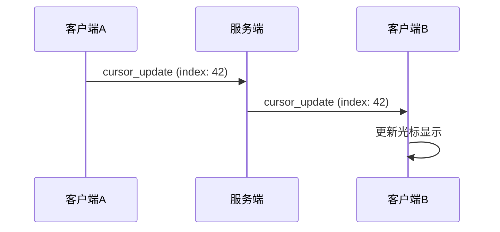

# 光标同步协议设计

## 概述

本文档定义协同编辑系统中光标位置同步的底层协议设计，包括数据结构、WebSocket信令、数据流转机制等。该协议与具体UI实现解耦，专注于数据层面的同步逻辑。

## 1. 光标数据结构

### 1.1 基础光标信息

```typescript
interface CursorPosition {
  // 光标在文档中的位置（字符索引）
  index: number;
  // 光标长度（用于选区，0表示光标，>0表示选区）
  length: number;
  // 用户标识
  userId: string;
  userName: string;
  // 时间戳（用于判断光标新鲜度）
  timestamp: number;
  // 光标颜色（用于区分不同用户）
  color: string;
}
```

### 1.2 扩展光标信息

```typescript
interface CursorInfo extends CursorPosition {
  // 光标状态（活跃、空闲、离线等）
  status: 'active' | 'idle' | 'offline';
  // 最后活动时间
  lastActivity: number;
  // 用户头像URL
  avatar?: string;
  // 自定义元数据
  metadata?: Record<string, any>;
}
```

## 2. WebSocket信令设计

### 2.1 光标同步消息类型

在现有的信令设计中扩展以下类型：

```typescript
// 客户端发送
type CursorSendCommandType = 
  | 'cursor_update'    // 光标位置更新
  | 'cursor_clear'     // 清除光标
  | 'presence_update'; // 用户状态更新

// 服务端推送
type CursorReceiveCommandType = 
  | 'cursor_update'    // 其他用户光标更新
  | 'cursor_clear'     // 其他用户光标清除
  | 'presence_update'  // 其他用户状态更新
  | 'cursor_list';     // 当前在线用户光标列表
```

### 2.2 消息格式定义

#### 光标更新消息

```json
{
  "type": "cursor_update",
  "timestamp": 1719320000000,
  "documentId": "doc-123",
  "userId": "user-abc",
  "sequence": 15,
  "data": {
    "index": 42,
    "length": 0,
    "userName": "张三",
    "color": "#3B82F6",
    "status": "active",
    "lastActivity": 1719320000000
  }
}
```

#### 光标清除消息

```json
{
  "type": "cursor_clear",
  "timestamp": 1719320000000,
  "documentId": "doc-123",
  "userId": "user-abc",
  "sequence": 16,
  "data": {}
}
```

#### 用户状态更新

```json
{
  "type": "presence_update",
  "timestamp": 1719320000000,
  "documentId": "doc-123",
  "userId": "user-abc",
  "sequence": 17,
  "data": {
    "status": "idle",
    "lastActivity": 1719320000000
  }
}
```

## 3. 数据流转机制

### 3.1 光标更新流程



### 3.2 状态同步策略

#### 频率控制

- **活跃状态**：光标移动时实时发送（节流到100ms）
- **空闲状态**：每5秒发送一次心跳
- **离线状态**：用户离开时发送清除消息

#### 去重机制

```typescript
// 伪代码：去重逻辑
function shouldSendCursorUpdate(newPosition: CursorPosition, lastPosition: CursorPosition): boolean {
  // 位置变化超过阈值才发送
  if (Math.abs(newPosition.index - lastPosition.index) < 2) {
    return false;
  }
  
  // 时间间隔太短则不发送
  if (newPosition.timestamp - lastPosition.timestamp < 100) {
    return false;
  }
  
  return true;
}
```

## 4. 冲突处理策略

### 4.1 时间戳冲突

当收到多个用户同时的光标更新时：

- 以时间戳为准，最新的覆盖旧的
- 如果时间戳相同，以用户ID排序

### 4.2 离线处理

```typescript
// 伪代码：离线检测
function handleUserOffline(userId: string): void {
  // 清除该用户的光标
  broadcastCursorClear(userId);
  
  // 更新用户列表
  updateOnlineUsers();
}
```

## 5. 性能优化策略

### 5.1 数据压缩

- 只传输变化的字段
- 使用增量更新而非全量同步

### 5.2 批量处理

```typescript
// 伪代码：批量发送
class CursorBatchProcessor {
  private pendingUpdates: CursorPosition[] = [];
  private batchTimeout: number = 50; // 50ms批处理窗口
  
  addUpdate(update: CursorPosition): void {
    this.pendingUpdates.push(update);
    this.scheduleBatchSend();
  }
  
  private scheduleBatchSend(): void {
    // 延迟发送，合并多个更新
  }
}
```

## 6. 扩展性考虑

### 6.1 多文档支持

- 光标信息包含documentId
- 支持用户在不同文档间切换

### 6.2 自定义元数据

- 预留metadata字段支持扩展
- 支持用户自定义光标样式

### 6.3 历史记录

- 可选的光标历史记录
- 支持光标轨迹回放

## 7. 错误处理

### 7.1 网络异常

- 光标更新失败时重试机制
- 断线重连时恢复光标状态

### 7.2 数据验证

```typescript
// 伪代码：数据验证
function validateCursorData(data: any): boolean {
  return (
    typeof data.index === 'number' &&
    data.index >= 0 &&
    typeof data.userId === 'string' &&
    data.userId.length > 0
  );
}
```

## 8. 测试策略

### 8.1 单元测试

- 数据结构验证
- 去重逻辑测试
- 冲突处理测试

### 8.2 集成测试

- 多用户光标同步
- 网络异常场景
- 性能压力测试

## 总结

本协议设计专注于光标数据同步的底层逻辑，与UI渲染层完全解耦。通过标准化的数据结构、可靠的信令机制和高效的同步策略，为上层的光标渲染提供稳定的数据支撑。
