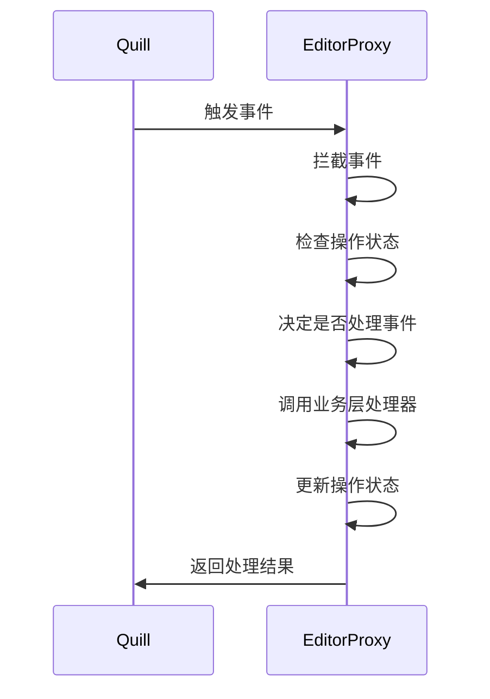

# 编辑器代理层方案可行性分析

## 问题背景

在协同编辑功能开发过程中，我们遇到了一个难以解决的 Quill 编辑器事件冲突问题：

### 问题现象

1. **远程更新触发本地事件**：当远程用户的操作通过 `quill.updateContents(delta, "silent")` 更新本地编辑器时，Quill 仍然会错误地触发 `text-change` 事件，且 `source` 为 `'user'`
2. **事件处理混乱**：这些错误的事件会被误认为是本地用户输入，导致重复处理和无限循环
3. **竞态条件**：多个事件处理器同时运行，造成状态不一致

### 问题根源

通过分析 Quill 源码发现：

- `updateContents` 方法内部调用 `modify` 函数
- `modify` 函数会触发 `EDITOR_CHANGE` 事件（总是触发）
- 但在某些情况下，`TEXT_CHANGE` 事件也会被错误触发，即使 `source` 设置为 `'silent'`
- 这可能是由于 Quill 内部的 DOM 更新机制或用户交互导致的连锁反应

### 已尝试的解决方案

1. **事件过滤**：通过检查 `source` 参数过滤事件 - 无效
2. **标志位控制**：使用 `isProcessingRemoteUpdate` 标志 - 部分有效但仍有问题
3. **延迟处理**：使用 `setTimeout` 延迟事件处理 - 无效
4. **方法替换**：临时替换事件监听器 - 复杂且不可靠

## 代理层方案优势

### 1. 完全掌控输入输出

- **事件拦截**：所有 Quill 事件都必须经过代理层，我们可以决定是否传递给外部
- **方法拦截**：所有对编辑器的更新都必须经过代理层，我们可以控制更新时机和方式
- **状态管理**：代理层内部维护状态，避免外部状态混乱

### 2. 避免竞态条件

- **单一入口**：所有操作都通过代理层，避免多个地方同时操作编辑器
- **状态隔离**：代理层内部状态与外部状态隔离，避免相互影响
- **原子操作**：每个操作都是原子的，要么完全成功，要么完全失败

### 3. 清晰的架构

- **职责分离**：代理层专门负责编辑器控制，业务层专注于业务逻辑
- **易于调试**：所有操作都有明确的日志，便于问题定位
- **易于扩展**：可以轻松添加新的控制逻辑，如防抖、节流等

### 4. 性能优化

- **减少事件处理**：只处理必要的事件，减少不必要的计算
- **批量操作**：可以将多个操作合并处理，提高效率
- **内存管理**：更好的内存使用和垃圾回收

## 实现方案

### 1. 代理层架构设计

```bash
┌─────────────────┐    ┌─────────────────┐    ┌─────────────────┐
│   业务层        │    │   代理层        │    │   Quill 编辑器  │
│                 │    │                 │    │                 │
│ - 事件监听      │◄──►│ - 事件拦截      │◄──►│ - 原始事件      │
│ - 内容更新      │    │ - 方法拦截      │    │ - 原始方法      │
│ - 状态管理      │    │ - 状态控制      │    │ - DOM 操作      │
└─────────────────┘    └─────────────────┘    └─────────────────┘
```

### 2. 核心功能模块

#### 2.1 事件代理模块

- **事件拦截**：拦截所有 Quill 事件（`text-change`, `selection-change` 等）
- **事件过滤**：根据业务逻辑决定是否传递事件
- **事件转换**：将 Quill 事件转换为业务事件

#### 2.2 方法代理模块

- **方法拦截**：拦截所有 Quill 方法（`updateContents`, `setContents` 等）
- **方法增强**：在原始方法基础上添加额外逻辑
- **方法保护**：防止不当的方法调用

#### 2.3 状态管理模块

- **操作状态**：跟踪当前正在执行的操作类型
- **锁定机制**：防止并发操作导致的状态冲突
- **状态同步**：确保代理层状态与编辑器状态一致

### 3. 实现步骤

#### 第一阶段：基础代理层

1. **创建 EditorProxy 类**
   - 封装 Quill 实例
   - 提供事件监听接口
   - 提供方法调用接口

2. **实现事件拦截**
   - 拦截 `text-change` 事件
   - 拦截 `selection-change` 事件
   - 提供事件过滤机制

3. **实现方法拦截**
   - 拦截 `updateContents` 方法
   - 拦截 `setContents` 方法
   - 提供方法增强机制

#### 第二阶段：状态控制

1. **实现操作状态管理**
   - 跟踪远程更新状态
   - 跟踪用户输入状态
   - 实现状态转换逻辑

2. **实现事件过滤逻辑**
   - 根据操作状态过滤事件
   - 实现事件优先级处理
   - 提供事件调试信息

#### 第三阶段：集成测试

1. **替换现有代码**
   - 将 Editor.tsx 中的 Quill 直接调用替换为代理层调用
   - 保持现有接口不变
   - 确保向后兼容

2. **全面测试**
   - 单元测试代理层功能
   - 集成测试协同编辑功能
   - 性能测试和压力测试

### 4. 技术实现细节

#### 4.1 类设计

```typescript
class EditorProxy {
  private quill: Quill;
  private eventHandlers: Map<string, Function[]>;
  private operationState: OperationState;
  
  // 事件相关方法
  on(eventName: string, handler: Function): void;
  off(eventName: string, handler?: Function): void;
  
  // 方法代理
  updateContents(delta: Delta): void;
  setContents(delta: Delta): void;
  getContents(): Delta;
  
  // 状态控制
  private setOperationState(state: OperationState): void;
  private shouldProcessEvent(eventName: string, source: string): boolean;
}
```

#### 4.2 状态管理

```typescript
enum OperationState {
  IDLE = 'idle',
  PROCESSING_REMOTE_UPDATE = 'processing_remote_update',
  PROCESSING_USER_INPUT = 'processing_user_input',
  PROCESSING_SYSTEM_UPDATE = 'processing_system_update'
}
```

#### 4.3 事件处理流程



## 风险评估

### 1. 技术风险

- **复杂度增加**：代理层增加了代码复杂度
- **性能影响**：代理层可能带来轻微的性能开销
- **兼容性问题**：可能与 Quill 版本升级产生兼容性问题

### 2. 缓解措施

- **渐进式实现**：分阶段实现，每阶段都充分测试
- **性能监控**：监控代理层的性能影响
- **版本锁定**：锁定 Quill 版本，避免兼容性问题
