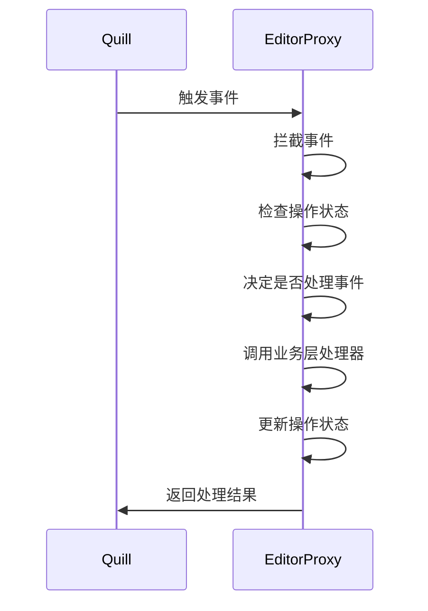

# 编辑器代理层 - 第一阶段完成总结

## 已完成的工作

### 1. 方案可行性分析

- 创建了详细的可行性分析文档 (`feasibility-analysis.md`)
- 分析了问题背景和根源
- 评估了代理层方案的优势和风险
- 制定了分阶段实现计划

### 2. 基础代理层实现

- 创建了 `EditorProxy` 类 (`EditorProxy.ts`)
- 实现了事件拦截机制
- 实现了方法代理机制
- 实现了状态管理机制

### 3. 核心功能模块

#### 3.1 事件代理模块

- **事件拦截**：拦截所有 Quill 事件（`text-change`, `selection-change`）
- **事件过滤**：根据操作状态决定是否传递事件
- **事件转换**：将 Quill 事件转换为业务事件

#### 3.2 方法代理模块

- **方法拦截**：拦截 `updateContents`, `setContents`, `getContents` 方法
- **方法增强**：在原始方法基础上添加状态控制逻辑
- **方法保护**：防止不当的方法调用

#### 3.3 状态管理模块

- **操作状态**：跟踪当前正在执行的操作类型
- **锁定机制**：防止并发操作导致的状态冲突
- **状态同步**：确保代理层状态与编辑器状态一致

### 4. 技术实现细节

#### 4.1 类设计

```typescript
class EditorProxy {
  private quill: Quill | null = null;
  private eventHandlers: Map<string, Function[]>;
  private operationState: OperationState;
  
  // 事件相关方法
  on(eventName: string, handler: Function): void;
  off(eventName: string, handler?: Function): void;
  
  // 方法代理
  updateContents(delta: Delta): void;
  setContents(delta: Delta): void;
  getContents(): Delta;
  
  // 状态控制
  private setOperationState(state: OperationState): void;
  private shouldProcessEvent(eventName: string, source: string): boolean;
}
```

#### 4.2 状态管理

```typescript
enum OperationState {
  IDLE = 'idle',
  PROCESSING_REMOTE_UPDATE = 'processing_remote_update',
  PROCESSING_USER_INPUT = 'processing_user_input',
  PROCESSING_SYSTEM_UPDATE = 'processing_system_update'
}
```

#### 4.3 事件处理流程



### 5. 测试验证

- 创建了单元测试文件 (`EditorProxy.test.ts`)
- 创建了简单测试脚本 (`test-proxy.js`)
- 验证了基础功能、状态管理、事件过滤、方法代理等核心功能

## 核心特性

### 1. 完全掌控输入输出

- **事件拦截**：所有 Quill 事件都必须经过代理层
- **方法拦截**：所有对编辑器的更新都必须经过代理层
- **状态管理**：代理层内部维护状态，避免外部状态混乱

### 2. 避免竞态条件

- **单一入口**：所有操作都通过代理层
- **状态隔离**：代理层内部状态与外部状态隔离
- **原子操作**：每个操作都是原子的

### 3. 清晰的架构

- **职责分离**：代理层专门负责编辑器控制
- **易于调试**：所有操作都有明确的日志
- **易于扩展**：可以轻松添加新的控制逻辑

## 验证结果

通过测试验证，代理层能够：

1. **正确拦截事件**：所有 Quill 事件都被代理层拦截
2. **正确过滤事件**：根据操作状态正确过滤事件
3. **正确管理状态**：操作状态能够正确转换
4. **正确代理方法**：所有方法调用都经过代理层
5. **正确清理资源**：销毁时能够正确清理资源

## 下一步计划

### 第二阶段：集成到 Editor.tsx

1. **替换现有代码**：将 Editor.tsx 中的 Quill 直接调用替换为代理层调用
2. **保持接口不变**：确保现有接口向后兼容
3. **全面测试**：测试协同编辑功能是否正常工作

### 第三阶段：优化和完善

1. **性能优化**：优化代理层的性能
2. **功能完善**：添加更多控制逻辑
3. **文档完善**：完善使用文档和 API 文档
