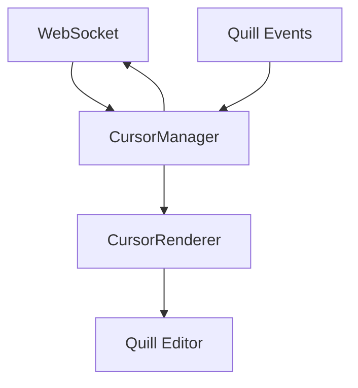

# 光标渲染器设计文档

## 概述

本文档定义协同编辑系统中光标在Quill编辑器中的渲染实现方案，包括光标显示、用户状态、交互反馈等UI层面的设计。该设计基于底层光标同步协议，专注于用户体验和渲染性能。

## 1. 架构设计

### 1.1 组件结构

```bash
CursorRenderer/
├── CursorRenderer.vue          # 主渲染组件
├── CursorOverlay.vue           # 光标覆盖层
├── UserCursor.vue              # 单个用户光标
├── UserPresence.vue            # 用户在线状态
├── CursorManager.ts            # 光标管理器
└── types.ts                    # 类型定义
```

### 1.2 数据流



## 2. 核心组件设计

### 2.1 CursorRenderer 主组件

**职责**：管理所有远程用户光标的渲染

```vue
<!-- 伪代码结构 -->
<template>
  <div class="cursor-renderer">
    <!-- 光标覆盖层 -->
    <CursorOverlay 
      :cursors="remoteCursors"
      :quill="quillInstance"
    />
    
    <!-- 用户状态面板 -->
    <UserPresence 
      :users="onlineUsers"
      :currentUser="currentUser"
    />
  </div>
</template>
```

### 2.2 CursorOverlay 覆盖层

**职责**：在Quill编辑器上渲染光标覆盖层

```vue
<!-- 伪代码结构 -->
<template>
  <div class="cursor-overlay" ref="overlay">
    <UserCursor
      v-for="cursor in cursors"
      :key="cursor.userId"
      :cursor="cursor"
      :quill="quill"
    />
  </div>
</template>
```

## 3. 光标定位算法

### 3.1 位置计算

```typescript
// 伪代码：光标位置计算
class CursorPositionCalculator {
  calculateCursorPosition(index: number, quill: Quill): Position {
    // 获取Quill中指定位置的坐标
    const bounds = quill.getBounds(index);
    
    return {
      left: bounds.left,
      top: bounds.top,
      height: bounds.height
    };
  }
  
  // 处理选区（selection）
  calculateSelectionRange(index: number, length: number, quill: Quill): Range {
    // 计算选区的起始和结束位置
    const startBounds = quill.getBounds(index);
    const endBounds = quill.getBounds(index + length);
    
    return {
      start: startBounds,
      end: endBounds,
      width: endBounds.left - startBounds.left
    };
  }
}
```

### 3.2 滚动同步

```typescript
// 伪代码：滚动同步
class ScrollSync {
  syncCursorPosition(cursor: UserCursor): void {
    // 监听Quill滚动事件
    this.quill.on('scroll', () => {
      this.updateCursorPosition(cursor);
    });
  }
}
```

## 4. 用户光标组件

### 4.1 视觉设计

```vue
<!-- 伪代码：用户光标组件 -->
<template>
  <div 
    class="user-cursor"
    :style="cursorStyle"
    :class="cursorClasses"
  >
    <!-- 光标线 -->
    <div class="cursor-line" :style="lineStyle" />
    
    <!-- 用户信息标签 -->
    <div class="user-label" v-if="showLabel">
      
      <span class="username">{{ cursor.userName }}</span>
    </div>
    
    <!-- 选区高亮 -->
    <div 
      v-if="cursor.length > 0" 
      class="selection-highlight"
      :style="selectionStyle"
    />
  </div>
</template>
```

### 4.2 样式设计

```scss
// 伪代码：光标样式
.user-cursor {
  position: absolute;
  pointer-events: none;
  z-index: 1000;
  
  .cursor-line {
    width: 2px;
    background-color: var(--cursor-color);
    animation: blink 1s infinite;
  }
  
  .user-label {
    position: absolute;
    top: -30px;
    left: 0;
    background: var(--cursor-color);
    color: white;
    padding: 2px 6px;
    border-radius: 4px;
    font-size: 12px;
    white-space: nowrap;
  }
  
  .selection-highlight {
    position: absolute;
    background-color: rgba(var(--cursor-color-rgb), 0.2);
    border: 1px solid var(--cursor-color);
  }
}
```

## 5. 用户状态管理

### 5.1 状态定义

```typescript
// 伪代码：用户状态
interface UserState {
  userId: string;
  userName: string;
  status: 'active' | 'idle' | 'offline';
  lastActivity: number;
  avatar?: string;
  color: string;
}

// 状态转换逻辑
class UserStateManager {
  updateUserState(userId: string, status: UserState['status']): void {
    // 更新用户状态
    // 触发UI更新
  }
  
  handleUserOffline(userId: string): void {
    // 清除用户光标
    // 更新在线用户列表
  }
}
```

### 5.2 在线用户面板

```vue
<!-- 伪代码：在线用户面板 -->
<template>
  <div class="user-presence-panel">
    <div class="panel-header">
      <span>在线用户 ({{ onlineUsers.length }})</span>
    </div>
    
    <div class="user-list">
      <div 
        v-for="user in onlineUsers"
        :key="user.userId"
        class="user-item"
        :class="user.status"
      >
        
        <span class="username">{{ user.userName }}</span>
        <span class="status-indicator" :style="{ backgroundColor: user.color }" />
      </div>
    </div>
  </div>
</template>
```

## 6. 性能优化

### 6.1 虚拟化渲染

```typescript
// 伪代码：虚拟化光标渲染
class VirtualizedCursorRenderer {
  private visibleCursors: UserCursor[] = [];
  
  updateVisibleCursors(): void {
    // 只渲染视口内的光标
    this.visibleCursors = this.allCursors.filter(cursor => 
      this.isCursorVisible(cursor)
    );
  }
  
  private isCursorVisible(cursor: UserCursor): boolean {
    // 检查光标是否在视口内
    const viewport = this.getViewportBounds();
    return this.intersects(cursor.bounds, viewport);
  }
}
```

### 6.2 节流和防抖

```typescript
// 伪代码：性能优化
class CursorUpdateOptimizer {
  private updateQueue: CursorUpdate[] = [];
  private throttleDelay = 16; // 60fps
  
  addUpdate(update: CursorUpdate): void {
    this.updateQueue.push(update);
    this.scheduleUpdate();
  }
  
  private scheduleUpdate(): void {
    // 使用 requestAnimationFrame 进行节流
    if (!this.updateScheduled) {
      this.updateScheduled = true;
      requestAnimationFrame(() => {
        this.processUpdates();
        this.updateScheduled = false;
      });
    }
  }
}
```

## 7. 交互体验

### 7.1 光标动画

```scss
// 伪代码：光标动画
@keyframes cursor-blink {
  0%, 50% { opacity: 1; }
  51%, 100% { opacity: 0; }
}

@keyframes cursor-fade-in {
  from { opacity: 0; transform: scale(0.8); }
  to { opacity: 1; transform: scale(1); }
}

.user-cursor {
  animation: cursor-fade-in 0.2s ease-out;
  
  .cursor-line {
    animation: cursor-blink 1s infinite;
  }
}
```

### 7.2 悬停交互

```vue
<!-- 伪代码：悬停交互 -->
<template>
  <div 
    class="user-cursor"
    @mouseenter="showUserInfo"
    @mouseleave="hideUserInfo"
  >
    <!-- 光标内容 -->
    
    <!-- 用户信息弹窗 -->
    <div v-if="showInfo" class="user-info-popup">
      <div class="user-details">
        
        <div class="user-info">
          <div class="username">{{ cursor.userName }}</div>
          <div class="status">{{ cursor.status }}</div>
          <div class="last-activity">{{ formatLastActivity(cursor.lastActivity) }}</div>
        </div>
      </div>
    </div>
  </div>
</template>
```

## 8. 错误处理

### 8.1 光标定位失败

```typescript
// 伪代码：错误处理
class CursorErrorHandler {
  handlePositionError(cursor: UserCursor, error: Error): void {
    // 记录错误日志
    console.warn('Cursor position error:', error);
    
    // 隐藏该光标
    this.hideCursor(cursor.userId);
    
    // 尝试重新定位
    this.retryPositionCalculation(cursor);
  }
  
  private retryPositionCalculation(cursor: UserCursor): void {
    // 延迟重试机制
    setTimeout(() => {
      this.recalculateCursorPosition(cursor);
    }, 1000);
  }
}
```

### 8.2 网络异常处理

```typescript
// 伪代码：网络异常处理
class CursorNetworkHandler {
  handleNetworkError(): void {
    // 显示网络状态提示
    this.showNetworkStatus('网络连接异常，光标同步可能延迟');
    
    // 保持本地光标显示
    this.keepLocalCursors();
    
    // 尝试重连
    this.attemptReconnection();
  }
}
```

## 9. 测试策略

### 9.1 单元测试

- 光标位置计算准确性
- 状态管理逻辑
- 性能优化效果

### 9.2 集成测试

- 多用户光标同步
- 滚动和缩放场景
- 网络异常恢复

### 9.3 用户体验测试

- 光标显示清晰度
- 动画流畅度
- 交互响应性

## 总结

本设计专注于光标在Quill编辑器中的渲染实现，通过合理的组件架构、高效的定位算法和流畅的交互体验，为用户提供直观的协同编辑反馈。设计充分考虑了性能优化和错误处理，确保在各种场景下都能提供稳定的用户体验。
