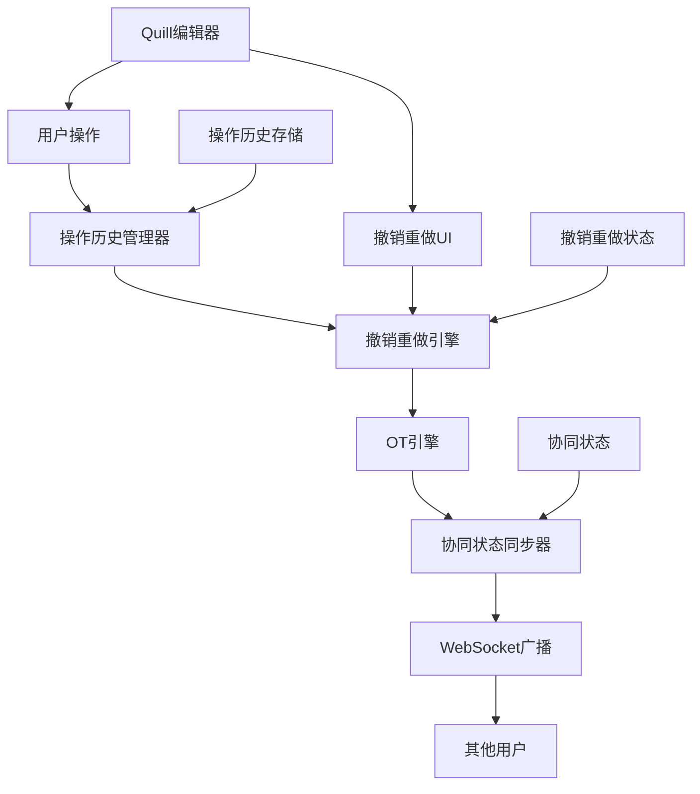
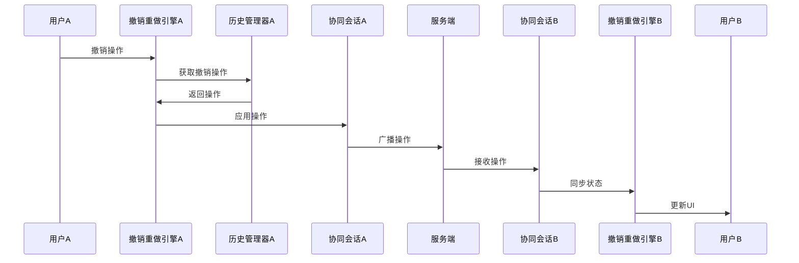

# 协同编辑撤销重做系统架构设计

## 系统概述

### 设计目标

- **协同一致性**：确保所有用户的撤销重做状态完全一致
- **操作原子性**：撤销重做操作要么完全成功，要么完全失败
- **性能优化**：支持大规模文档的高效操作历史管理
- **用户体验**：提供流畅的撤销重做体验

### 核心挑战

- **操作顺序一致性**：多用户同时操作时的全局操作顺序管理
- **状态同步**：实时同步所有用户的撤销重做状态
- **冲突解决**：处理撤销重做过程中的协同冲突

## 系统架构

### 整体架构图



## 核心模块设计

### 1. 操作历史管理器 (OperationHistoryManager)

#### 数据结构

```typescript
// 操作类型枚举 - 支持未来扩展
enum OperationType {
  // 基础操作类型
  INSERT = 'insert',
  DELETE = 'delete',
  FORMAT = 'format',
  UNDO = 'undo',
  REDO = 'redo',
  
  // 复合操作类型
  COMPOSITE = 'composite',
  BATCH = 'batch',
  
  // 未来扩展的操作类型
  IMAGE_INSERT = 'image_insert',
  TABLE_OPERATION = 'table_operation',
  CODE_BLOCK = 'code_block',
  MATH_FORMULA = 'math_formula',
  COMMENT = 'comment',
  ANNOTATION = 'annotation',
  MARKDOWN_CONVERSION = 'markdown_conversion',
  PLUGIN_OPERATION = 'plugin_operation'
}

// 操作历史项接口
interface OperationHistoryItem {
  id: string;                    // 唯一标识
  type: OperationType;           // 操作类型
  operation: Delta;              // Delta操作
  timestamp: number;             // 时间戳
  userId: string;                // 操作用户ID
  documentId: string;            // 文档ID
  sequenceNumber: number;        // 全局序列号
  undoable: boolean;             // 是否可撤销
  redoable: boolean;             // 是否可重做
  metadata?: Record<string, any>; // 扩展元数据
  
  // 扩展字段
  parentOperationId?: string;    // 父操作ID（用于复合操作）
  childOperationIds?: string[];  // 子操作ID列表
  pluginId?: string;             // 插件ID（如果是插件操作）
  category?: string;             // 操作分类
  tags?: string[];               // 操作标签
  priority?: number;             // 操作优先级
}
```

#### 核心功能

- **操作栈管理**：维护撤销栈和重做栈
- **操作元数据**：记录操作的完整上下文信息
- **内存优化**：分页加载、智能清理、压缩存储
- **存储抽象**：支持多种存储后端（内存、数据库、混合）
- **操作分类**：按类型、分类、标签组织操作历史
- **操作关联**：处理复合操作和操作依赖关系

### 2. 撤销重做引擎 (UndoRedoEngine)

#### 核心算法

```typescript
// 操作处理策略接口
interface IOperationStrategy {
  name: string;
  canHandle(operation: OperationHistoryItem): boolean;
  process(operation: OperationHistoryItem): Promise<ProcessResult>;
  validate(operation: OperationHistoryItem): ValidationResult;
  undo(operation: OperationHistoryItem): Promise<UndoResult>;
  redo(operation: OperationHistoryItem): Promise<RedoResult>;
}

// 撤销重做引擎 - 支持策略模式和插件系统
class UndoRedoEngine {
  private operationHistory: OperationHistoryManager;
  private otEngine: OTEngine;
  private session: OTSession;
  private strategies: Map<string, IOperationStrategy> = new Map();
  private plugins: Map<string, IUndoRedoPlugin> = new Map();
  private eventEmitter: EventEmitter;
  
  constructor(
    operationHistory: OperationHistoryManager,
    otEngine: OTEngine,
    session: OTSession,
    config: UndoRedoConfig
  ) {
    this.operationHistory = operationHistory;
    this.otEngine = otEngine;
    this.session = session;
    this.eventEmitter = new EventEmitter();
    
    // 初始化默认策略
    this.initializeDefaultStrategies();
    
    // 加载插件
    if (config.plugins) {
      this.loadPlugins(config.plugins);
    }
  }
  
  // 注册操作策略
  registerStrategy(strategy: IOperationStrategy): void {
    this.strategies.set(strategy.name, strategy);
  }
  
  // 撤销操作 - 支持策略模式
  async undo(): Promise<UndoRedoResult> {
    const operation = this.operationHistory.popUndo();
    if (!operation) {
      return { success: false, error: 'No operation to undo' };
    }
    
    try {
      // 查找合适的策略处理操作
      const strategy = this.findStrategy(operation);
      if (!strategy) {
        throw new Error(`No strategy found for operation type: ${operation.type}`);
      }
      
      // 通过策略处理撤销
      const undoResult = await strategy.undo(operation);
      
      // 通过OT引擎处理协同
      const transformedOp = await this.otEngine.transform(undoResult.operation);
      
      // 应用撤销操作
      await this.applyOperation(transformedOp);
      
      // 更新状态
      this.updateUndoRedoState();
      
      // 触发事件
      this.eventEmitter.emit('operationUndone', operation);
      
      return { success: true, operation: transformedOp };
    } catch (error) {
      // 回滚操作
      await this.rollbackOperation(operation);
      
      // 触发错误事件
      this.eventEmitter.emit('operationError', { operation, error });
      
      return { success: false, error: error.message };
    }
  }
  
  // 重做操作 - 类似实现
  async redo(): Promise<UndoRedoResult> {
    // 类似实现，支持策略模式
  }
  
  // 查找合适的策略
  private findStrategy(operation: OperationHistoryItem): IOperationStrategy | undefined {
    for (const strategy of this.strategies.values()) {
      if (strategy.canHandle(operation)) {
        return strategy;
      }
    }
    return undefined;
  }
  
  // 初始化默认策略
  private initializeDefaultStrategies(): void {
    this.registerStrategy(new TextOperationStrategy());
    this.registerStrategy(new FormatOperationStrategy());
    this.registerStrategy(new CompositeOperationStrategy());
  }
  
  // 加载插件
  private async loadPlugins(plugins: IUndoRedoPlugin[]): Promise<void> {
    for (const plugin of plugins) {
      try {
        await plugin.initialize(this);
        this.plugins.set(plugin.name, plugin);
        this.logger.info(`Plugin loaded: ${plugin.name}`);
      } catch (error) {
        this.logger.error(`Failed to load plugin: ${plugin.name}`, error);
      }
    }
  }
}
```

### 3. 存储层抽象 (Storage Layer)

#### 存储接口设计

```typescript
// 存储接口抽象
interface IOperationStorage {
  name: string;
  type: 'memory' | 'database' | 'hybrid' | 'custom';
  
  // 基础CRUD操作
  save(operation: OperationHistoryItem): Promise<void>;
  load(id: string): Promise<OperationHistoryItem | null>;
  query(filter: OperationFilter): Promise<OperationHistoryItem[]>;
  delete(id: string): Promise<void>;
  clear(): Promise<void>;
  
  // 批量操作
  batchSave(operations: OperationHistoryItem[]): Promise<void>;
  batchLoad(ids: string[]): Promise<OperationHistoryItem[]>;
  
  // 高级查询
  findByType(type: OperationType): Promise<OperationHistoryItem[]>;
  findByUser(userId: string): Promise<OperationHistoryItem[]>;
  findByTimeRange(start: number, end: number): Promise<OperationHistoryItem[]>;
  findByCategory(category: string): Promise<OperationHistoryItem[]>;
  
  // 统计信息
  getStats(): Promise<StorageStats>;
  getSize(): Promise<number>;
  
  // 生命周期管理
  initialize(): Promise<void>;
  destroy(): Promise<void>;
}

// 存储过滤器
interface OperationFilter {
  type?: OperationType;
  userId?: string;
  documentId?: string;
  category?: string;
  tags?: string[];
  startTime?: number;
  endTime?: number;
  limit?: number;
  offset?: number;
  sortBy?: 'timestamp' | 'sequenceNumber' | 'priority';
  sortOrder?: 'asc' | 'desc';
}

// 存储统计信息
interface StorageStats {
  totalOperations: number;
  operationsByType: Record<OperationType, number>;
  operationsByUser: Record<string, number>;
  operationsByCategory: Record<string, number>;
  memoryUsage: number;
  lastCleanupTime: number;
}
```

#### 存储实现

```typescript
// 内存存储实现
class MemoryOperationStorage implements IOperationStorage {
  name = 'memory';
  type = 'memory' as const;
  private operations = new Map<string, OperationHistoryItem>();
  
  async save(operation: OperationHistoryItem): Promise<void> {
    this.operations.set(operation.id, operation);
  }
  
  async load(id: string): Promise<OperationHistoryItem | null> {
    return this.operations.get(id) || null;
  }
  
  // 其他方法实现...
}

// 数据库存储实现
class DatabaseOperationStorage implements IOperationStorage {
  name = 'database';
  type = 'database' as const;
  
  async save(operation: OperationHistoryItem): Promise<void> {
    // 数据库存储实现
  }
  
  // 其他方法实现...
}

// 混合存储实现（内存+数据库）
class HybridOperationStorage implements IOperationStorage {
  name = 'hybrid';
  type = 'hybrid' as const;
  private memoryStorage: MemoryOperationStorage;
  private databaseStorage: DatabaseOperationStorage;
  
  constructor() {
    this.memoryStorage = new MemoryOperationStorage();
    this.databaseStorage = new DatabaseOperationStorage();
  }
  
  async save(operation: OperationHistoryItem): Promise<void> {
    // 同时保存到内存和数据库
    await Promise.all([
      this.memoryStorage.save(operation),
      this.databaseStorage.save(operation)
    ]);
  }
  
  // 其他方法实现...
}
```

### 4. 事件系统 (Event System)

#### 事件接口设计

```typescript
// 事件接口
interface IUndoRedoEvents {
  // 操作事件
  onOperationApplied(operation: OperationHistoryItem): void;
  onOperationUndone(operation: OperationHistoryItem): void;
  onOperationRedone(operation: OperationHistoryItem): void;
  onOperationFailed(operation: OperationHistoryItem, error: Error): void;
  
  // 状态事件
  onStateChanged(state: UndoRedoState): void;
  onUndoStackChanged(operations: OperationHistoryItem[]): void;
  onRedoStackChanged(operations: OperationHistoryItem[]): void;
  
  // 协同事件
  onConflictDetected(conflict: ConflictInfo): void;
  onConflictResolved(conflict: ConflictInfo, resolution: ConflictResolution): void;
  onRemoteStateReceived(remoteState: UndoRedoState): void;
  
  // 性能事件
  onMemoryUsageChanged(usage: number, limit: number): void;
  onOperationProcessed(operation: OperationHistoryItem, duration: number): void;
  
  // 插件事件
  onPluginLoaded(plugin: IUndoRedoPlugin): void;
  onPluginError(plugin: IUndoRedoPlugin, error: Error): void;
}

// 事件发射器
class EventEmitter {
  private listeners = new Map<string, Function[]>();
  
  on(event: string, listener: Function): void;
  off(event: string, listener: Function): void;
  emit(event: string, ...args: any[]): void;
  once(event: string, listener: Function): void;
}
```

### 5. 协同状态同步器 (CollaborativeStateSync)

#### 状态同步机制

```typescript
interface UndoRedoState {
  canUndo: boolean;              // 是否可撤销
  canRedo: boolean;              // 是否可重做
  undoStackSize: number;         // 撤销栈大小
  redoStackSize: number;         // 重做栈大小
  collaborativeState: CollaborativeState; // 协同状态
  lastSyncTimestamp: number;     // 最后同步时间
  
  // 扩展状态信息
  activePlugins: string[];       // 活跃插件列表
  storageStats: StorageStats;    // 存储统计信息
  performanceMetrics: PerformanceMetrics; // 性能指标
}

enum CollaborativeState {
  IDLE = 'idle',                 // 空闲状态
  UNDOING = 'undoing',           // 撤销中
  REDOING = 'redoing',           // 重做中
  CONFLICT = 'conflict',         // 冲突状态
  SYNCING = 'syncing',           // 同步中
  PLUGIN_PROCESSING = 'plugin_processing' // 插件处理中
}

// 性能指标
interface PerformanceMetrics {
  averageOperationTime: number;  // 平均操作处理时间
  memoryUsage: number;           // 内存使用量
  storageLatency: number;        // 存储延迟
  networkLatency: number;        // 网络延迟
  lastUpdateTime: number;        // 最后更新时间
}
```

### 6. 插件系统 (Plugin System)

#### 插件接口设计

```typescript
// 插件接口
interface IUndoRedoPlugin {
  name: string;                  // 插件名称
  version: string;               // 插件版本
  description: string;           // 插件描述
  author: string;                // 插件作者
  dependencies?: string[];       // 依赖的其他插件
  
  // 生命周期方法
  initialize(engine: UndoRedoEngine): Promise<void>;
  destroy(): Promise<void>;
  
  // 操作处理
  canHandleOperation(operation: OperationHistoryItem): boolean;
  processOperation(operation: OperationHistoryItem): Promise<ProcessResult>;
  
  // 事件处理
  onOperationApplied(operation: OperationHistoryItem): void;
  onOperationUndone(operation: OperationHistoryItem): void;
  onOperationRedone(operation: OperationHistoryItem): void;
  
  // 状态管理
  getPluginState(): Record<string, any>;
  setPluginState(state: Record<string, any>): void;
  
  // 配置管理
  getConfig(): PluginConfig;
  updateConfig(config: Partial<PluginConfig>): void;
}

// 插件配置
interface PluginConfig {
  enabled: boolean;              // 是否启用
  priority: number;              // 优先级
  settings: Record<string, any>; // 插件特定设置
}

// 插件管理器
class PluginManager {
  private plugins = new Map<string, IUndoRedoPlugin>();
  private engine: UndoRedoEngine;
  
  constructor(engine: UndoRedoEngine) {
    this.engine = engine;
  }
  
  // 注册插件
  registerPlugin(plugin: IUndoRedoPlugin): Promise<void>;
  
  // 卸载插件
  unregisterPlugin(pluginName: string): Promise<void>;
  
  // 获取插件
  getPlugin(pluginName: string): IUndoRedoPlugin | undefined;
  
  // 获取所有插件
  getAllPlugins(): IUndoRedoPlugin[];
  
  // 启用/禁用插件
  enablePlugin(pluginName: string): Promise<void>;
  disablePlugin(pluginName: string): Promise<void>;
  
  // 插件依赖检查
  checkDependencies(plugin: IUndoRedoPlugin): DependencyCheckResult;
}
```

### 7. 操作链和宏操作 (Operation Chain & Macro)

#### 操作链设计

```typescript
// 操作链接口
interface IOperationChain {
  id: string;                    // 操作链ID
  name: string;                  // 操作链名称
  description: string;           // 操作链描述
  operations: OperationHistoryItem[]; // 操作列表
  metadata: ChainMetadata;       // 元数据
  
  // 执行方法
  execute(): Promise<ChainExecutionResult>;
  undo(): Promise<void>;
  redo(): Promise<void>;
  
  // 验证方法
  validate(): ValidationResult;
  canExecute(): boolean;
  
  // 状态查询
  getExecutionState(): ChainExecutionState;
  getProgress(): number;         // 执行进度 0-1
}

// 操作链元数据
interface ChainMetadata {
  category: string;              // 分类
  tags: string[];                // 标签
  priority: number;              // 优先级
  estimatedDuration: number;     // 预估执行时间
  requiresConfirmation: boolean; // 是否需要用户确认
  canBeInterrupted: boolean;     // 是否可以被中断
  dependencies: string[];        // 依赖的其他操作链
}

// 操作链执行状态
enum ChainExecutionState {
  PENDING = 'pending',           // 等待执行
  EXECUTING = 'executing',       // 执行中
  COMPLETED = 'completed',       // 执行完成
  FAILED = 'failed',             // 执行失败
  INTERRUPTED = 'interrupted',   // 被中断
  ROLLED_BACK = 'rolled_back'    // 已回滚
}

// 操作链管理器
class OperationChainManager {
  private chains = new Map<string, IOperationChain>();
  private executionQueue: IOperationChain[] = [];
  private activeChains = new Set<string>();
  
  // 注册操作链
  registerChain(chain: IOperationChain): void;
  
  // 执行操作链
  executeChain(chainId: string): Promise<ChainExecutionResult>;
  
  // 中断操作链
  interruptChain(chainId: string): Promise<void>;
  
  // 获取操作链状态
  getChainStatus(chainId: string): ChainExecutionState;
  
  // 获取所有操作链
  getAllChains(): IOperationChain[];
  
  // 按分类查询操作链
  getChainsByCategory(category: string): IOperationChain[];
}
```

## 数据流设计

### 撤销重做操作流程



## 性能优化策略

### 1. 内存优化

- **分页加载**：操作历史按页加载，减少内存占用
- **智能清理**：LRU策略清理不常用的操作历史
- **压缩存储**：对操作数据进行压缩存储

### 2. 操作优化

- **操作合并**：合并连续的相同类型操作
- **批量处理**：批量处理撤销重做操作
- **增量同步**：只同步变更的状态信息

## 错误处理与恢复

### 1. 错误类型

- **操作无效错误**：撤销重做操作无效
- **状态不一致错误**：本地状态与远程状态不一致
- **网络错误**：网络连接问题
- **冲突错误**：操作冲突无法解决

### 2. 恢复策略

- **操作回滚**：回滚到上一个有效状态
- **状态同步**：与远程状态重新同步
- **用户提示**：向用户显示错误信息和解决建议

## 用户界面设计

### 1. 工具栏按钮

- **撤销按钮**：显示当前可撤销状态
- **重做按钮**：显示当前可重做状态
- **历史按钮**：显示操作历史列表
- **状态指示器**：显示协同编辑状态

### 2. 快捷键支持

- **Ctrl+Z**：撤销操作
- **Ctrl+Y / Ctrl+Shift+Z**：重做操作
- **Ctrl+Shift+H**：显示操作历史

## 测试策略

### 1. 单元测试

- **操作历史管理测试**：测试操作栈管理、内存优化等
- **撤销重做引擎测试**：测试操作转换、状态管理等
- **协同状态同步测试**：测试状态同步、冲突解决等

### 2. 集成测试

- **端到端测试**：测试完整的撤销重做流程
- **多用户测试**：测试多用户协同撤销重做
- **性能测试**：测试大规模文档的性能表现

## 部署与配置

### 环境配置

```typescript
interface UndoRedoConfig {
  // 基础配置
  maxHistorySize: number;        // 最大历史记录数
  maxMemoryUsage: number;        // 最大内存使用量
  syncInterval: number;          // 同步间隔
  retryAttempts: number;         // 重试次数
  conflictTimeout: number;       // 冲突超时时间
  
  // 扩展配置
  plugins?: IUndoRedoPlugin[];   // 插件列表
  storage?: IOperationStorage;   // 存储后端
  strategies?: IOperationStrategy[]; // 操作策略
  eventHandlers?: IUndoRedoEvents; // 事件处理器
  
  // 性能配置
  enableCompression: boolean;    // 是否启用压缩
  enableLazyLoading: boolean;    // 是否启用懒加载
  batchSize: number;             // 批处理大小
  maxConcurrentOperations: number; // 最大并发操作数
  
  // 协同配置
  conflictResolution: 'optimistic' | 'pessimistic' | 'hybrid'; // 冲突解决策略
  syncMode: 'realtime' | 'batch' | 'manual'; // 同步模式
  enableOperationChaining: boolean; // 是否启用操作链
  maxChainLength: number;        // 最大操作链长度
  
  // 插件配置
  pluginConfig: {
    autoLoad: boolean;           // 自动加载插件
    pluginDirectory: string;     // 插件目录
    enableHotReload: boolean;    // 启用热重载
    maxPluginMemory: number;     // 插件最大内存使用
  };
  
  // 监控配置
  enableMetrics: boolean;        // 启用性能监控
  metricsInterval: number;       // 监控间隔
  enableLogging: boolean;        // 启用日志记录
  logLevel: 'debug' | 'info' | 'warn' | 'error'; // 日志级别
}
```

## 总结

协同编辑撤销重做系统需要解决操作一致性、状态同步、冲突解决等多个技术挑战。通过模块化设计、性能优化、错误处理等策略，可以构建一个稳定、高效、用户友好的撤销重做系统。

### 架构扩展性特点

#### 1. **高度模块化设计**

- **职责分离**：每个模块都有明确的职责和接口
- **松耦合架构**：模块间通过接口通信，便于独立开发和测试
- **可替换性**：核心组件都可以被替换实现

#### 2. **插件化架构**

- **插件系统**：支持动态加载和卸载插件
- **扩展点丰富**：提供多个扩展点供插件使用
- **热插拔**：支持运行时插件管理

#### 3. **策略模式支持**

- **操作策略**：不同类型的操作可以使用不同的处理策略
- **策略注册**：支持动态注册新的操作策略
- **策略组合**：支持策略的组合和链式处理

#### 4. **存储层抽象**

- **多存储后端**：支持内存、数据库、混合等多种存储方式
- **存储接口统一**：所有存储实现都遵循统一接口
- **存储切换**：支持运行时切换存储后端

#### 5. **事件驱动架构**

- **事件系统**：完整的事件发布订阅机制
- **事件类型丰富**：覆盖操作、状态、性能、插件等各个方面
- **事件扩展**：支持自定义事件类型和处理器

#### 6. **操作链支持**

- **宏操作**：支持复杂的操作组合
- **操作链管理**：完整的操作链生命周期管理
- **中断和恢复**：支持操作链的中断和恢复

### 关键成功因素

1. **架构设计**：清晰的模块划分和接口设计
2. **扩展性设计**：插件化、策略化、事件驱动等扩展机制
3. **性能优化**：合理的内存管理和网络优化策略
4. **错误处理**：完善的错误检测、处理和恢复机制
5. **用户体验**：流畅的操作体验和及时的状态反馈
6. **未来兼容**：为未来的功能扩展预留了充分的扩展点

### 扩展性应用场景

#### 1. **编辑器功能扩展**

- **Markdown支持**：通过插件实现Markdown语法转换
- **表格编辑**：通过策略模式处理表格操作
- **图片处理**：通过操作链实现复杂的图片操作
- **代码高亮**：通过插件实现语法高亮功能

#### 2. **协同编辑增强**

- **权限管理**：通过插件实现细粒度权限控制
- **版本管理**：通过操作链实现版本回滚和对比
- **评论系统**：通过事件系统实现实时评论同步
- **离线支持**：通过存储抽象实现离线编辑

#### 3. **性能优化扩展**

- **缓存策略**：通过插件实现智能缓存
- **压缩算法**：通过策略模式选择最优压缩算法
- **负载均衡**：通过事件系统实现动态负载调整
- **监控告警**：通过插件实现性能监控和告警

#### 4. **集成扩展**

- **第三方服务**：通过插件集成云存储、AI服务等
- **API扩展**：通过事件系统提供丰富的API接口
- **数据导出**：通过操作链实现多种格式导出
- **工作流集成**：通过插件集成工作流系统
