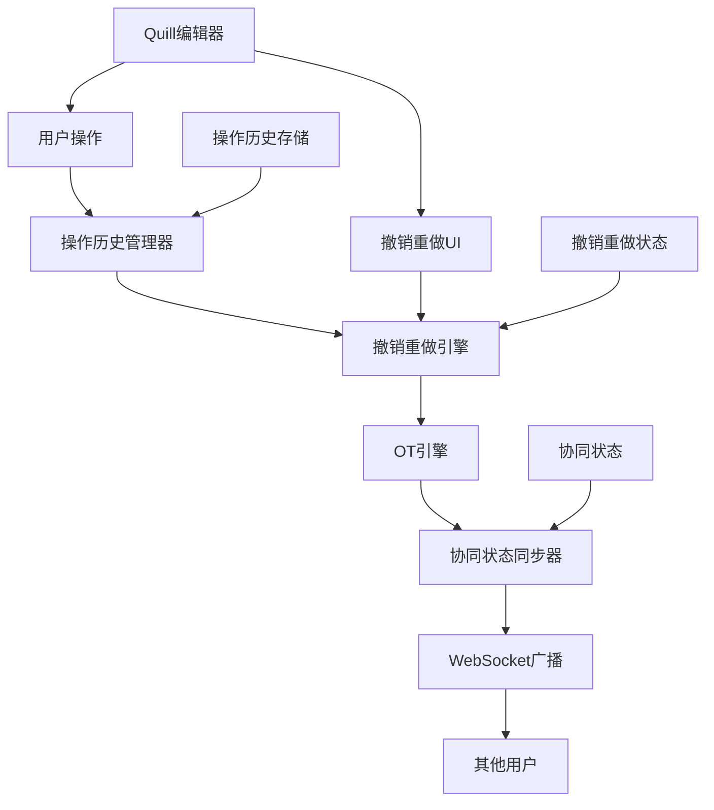
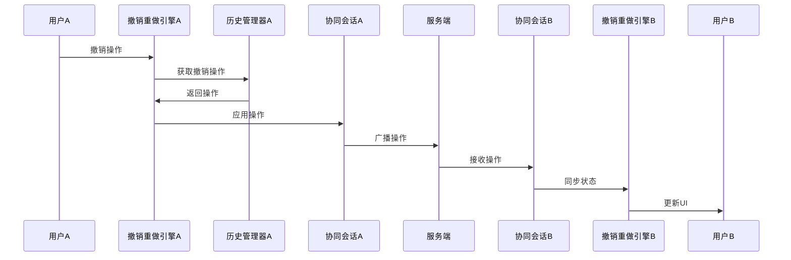

# 协同编辑撤销重做系统架构设计

## 系统概述

### 设计目标

- **协同一致性**：确保所有用户的撤销重做状态完全一致
- **操作原子性**：撤销重做操作要么完全成功，要么完全失败
- **性能优化**：支持大规模文档的高效操作历史管理
- **用户体验**：提供流畅的撤销重做体验

### 核心挑战

- **操作顺序一致性**：多用户同时操作时的全局操作顺序管理
- **状态同步**：实时同步所有用户的撤销重做状态
- **冲突解决**：处理撤销重做过程中的协同冲突

## 系统架构

### 整体架构图



## 核心模块设计

### 1. 操作历史管理器 (OperationHistoryManager)

#### 数据结构

```typescript
interface OperationHistoryItem {
  id: string;                    // 唯一标识
  type: OperationType;           // 操作类型
  operation: Delta;              // Delta操作
  timestamp: number;             // 时间戳
  userId: string;                // 操作用户ID
  documentId: string;            // 文档ID
  sequenceNumber: number;        // 全局序列号
  undoable: boolean;             // 是否可撤销
  redoable: boolean;             // 是否可重做
  metadata?: Record<string, any>; // 扩展元数据
}
```

#### 核心功能

- **操作栈管理**：维护撤销栈和重做栈
- **操作元数据**：记录操作的完整上下文信息
- **内存优化**：分页加载、智能清理、压缩存储

### 2. 撤销重做引擎 (UndoRedoEngine)

#### 核心算法

```typescript
class UndoRedoEngine {
  private operationHistory: OperationHistoryManager;
  private otEngine: OTEngine;
  private session: OTSession;
  
  // 撤销操作
  async undo(): Promise<UndoRedoResult> {
    const operation = this.operationHistory.popUndo();
    if (!operation) {
      return { success: false, error: 'No operation to undo' };
    }
    
    try {
      // 通过OT引擎处理撤销
      const transformedOp = await this.otEngine.transform(operation);
      
      // 应用撤销操作
      await this.applyOperation(transformedOp);
      
      // 更新状态
      this.updateUndoRedoState();
      
      return { success: true, operation: transformedOp };
    } catch (error) {
      // 回滚操作
      await this.rollbackOperation(operation);
      return { success: false, error: error.message };
    }
  }
}
```

### 3. 协同状态同步器 (CollaborativeStateSync)

#### 状态同步机制

```typescript
interface UndoRedoState {
  canUndo: boolean;              // 是否可撤销
  canRedo: boolean;              // 是否可重做
  undoStackSize: number;         // 撤销栈大小
  redoStackSize: number;         // 重做栈大小
  collaborativeState: CollaborativeState; // 协同状态
  lastSyncTimestamp: number;     // 最后同步时间
}

enum CollaborativeState {
  IDLE = 'idle',                 // 空闲状态
  UNDOING = 'undoing',           // 撤销中
  REDOING = 'redoing',           // 重做中
  CONFLICT = 'conflict',         // 冲突状态
  SYNCING = 'syncing'            // 同步中
}
```

## 数据流设计

### 撤销重做操作流程



## 性能优化策略

### 1. 内存优化

- **分页加载**：操作历史按页加载，减少内存占用
- **智能清理**：LRU策略清理不常用的操作历史
- **压缩存储**：对操作数据进行压缩存储

### 2. 操作优化

- **操作合并**：合并连续的相同类型操作
- **批量处理**：批量处理撤销重做操作
- **增量同步**：只同步变更的状态信息

## 错误处理与恢复

### 1. 错误类型

- **操作无效错误**：撤销重做操作无效
- **状态不一致错误**：本地状态与远程状态不一致
- **网络错误**：网络连接问题
- **冲突错误**：操作冲突无法解决

### 2. 恢复策略

- **操作回滚**：回滚到上一个有效状态
- **状态同步**：与远程状态重新同步
- **用户提示**：向用户显示错误信息和解决建议

## 用户界面设计

### 1. 工具栏按钮

- **撤销按钮**：显示当前可撤销状态
- **重做按钮**：显示当前可重做状态
- **历史按钮**：显示操作历史列表
- **状态指示器**：显示协同编辑状态

### 2. 快捷键支持

- **Ctrl+Z**：撤销操作
- **Ctrl+Y / Ctrl+Shift+Z**：重做操作
- **Ctrl+Shift+H**：显示操作历史

## 测试策略

### 1. 单元测试

- **操作历史管理测试**：测试操作栈管理、内存优化等
- **撤销重做引擎测试**：测试操作转换、状态管理等
- **协同状态同步测试**：测试状态同步、冲突解决等

### 2. 集成测试

- **端到端测试**：测试完整的撤销重做流程
- **多用户测试**：测试多用户协同撤销重做
- **性能测试**：测试大规模文档的性能表现

## 部署与配置

### 环境配置

```typescript
interface UndoRedoConfig {
  maxHistorySize: number;        // 最大历史记录数
  maxMemoryUsage: number;        // 最大内存使用量
  syncInterval: number;          // 同步间隔
  retryAttempts: number;         // 重试次数
  conflictTimeout: number;       // 冲突超时时间
}
```

## 总结

协同编辑撤销重做系统需要解决操作一致性、状态同步、冲突解决等多个技术挑战。通过模块化设计、性能优化、错误处理等策略，可以构建一个稳定、高效、用户友好的撤销重做系统。

### 关键成功因素

1. **架构设计**：清晰的模块划分和接口设计
2. **性能优化**：合理的内存管理和网络优化策略
3. **错误处理**：完善的错误检测、处理和恢复机制
4. **用户体验**：流畅的操作体验和及时的状态反馈
